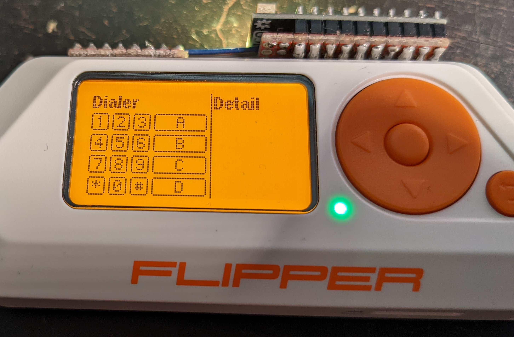

## DTMF Dolphin

DTMF (Dual-Tone Multi-Frequency) dialer, Bluebox, and future Redbox.

Now in a release-ready state for both Dialer and Bluebox functionality. Redbox functionality awaits some changes for modulation.

Please note that using the current tone output method, the 2600 tone is scaled about 33 Hz higher than it should be. This is a limitation of the current sample rate.
