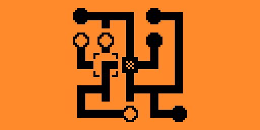

# "Connect Wires" game for Flipper Zero

This is a modified version of Alexander Taran's connect_wires game.

In addition to the original:  

- famous puzzle concept
- play on 3 different complexity levels

The new version allows:  

- tracking score (via rotations made)
- allows rotating clockwise or counter-clockwise
  
See if you can beat a score of 70 in hard mode!  
  

  
- Press Ok to rotate the selection.  
- Long press Ok to rotate clockwise (LED blinks briefly green and vibrates).  
- Long press Back to rotate counter-clockwise. (LED blinks briefly red and vibrates).  

#### License
[MIT](https://github.com/AlexTaran/flipperzero/blob/master/games/connect_wires/LICENSE)
Copyright 2023 Alexander Taran  
https://github.com/AlexTaran/flipperzero/tree/master/games/connect_wires  
Copyright 2024 Andrew Diamond  
Connect_wires_2 modified by Andrew Diamond, still under the same [MIT](LICENSE) issued license.  
https://github.com/HappyAmos/Flipper_FAPS  

