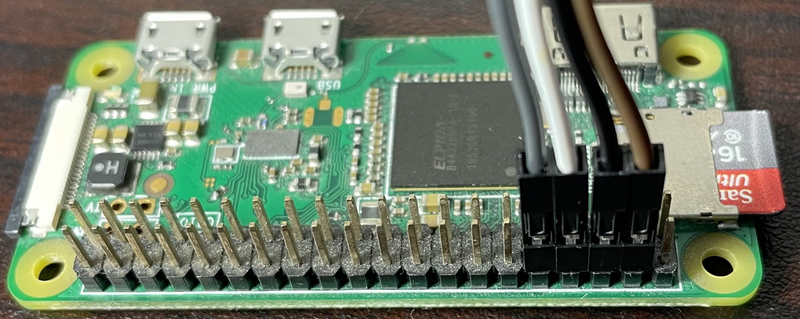

# Hardware Communication
## Flipper
- Through UART
	- 5v: 5v
	- Tx: 13
	- Rx: 14
	- GND: 18

## RPI 0 W
- Through UART (must have bluetooth disabled)
	- 5v: 5v
	- Tx: GPIO 14
	- Rx: GPIO 15
	- GND: 6

##### Disable Bluetooth
In /boot/config.txt add:
```
dt-overlay=disable-bt
```

## Interface
| Flipper | Jumpers | RPI    |
| ------- | ------- | -------|
| 5v      | Brown   | 5v     |
| Tx      | Gray    | Rx     |
| Rx      | White   | Tx     |
| GND     | Black   | GND    |

#### Flipper Wiring


#### RPI Wiring
