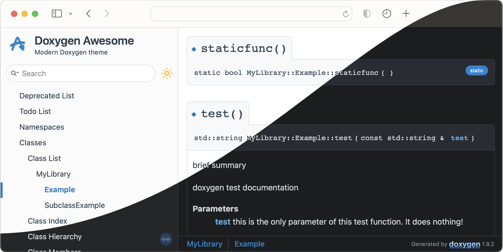
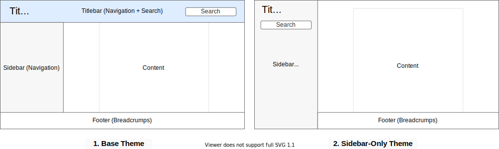

#  Doxygen Awesome

[](https://github.com/jothepro/doxygen-awesome-css/releases/latest)
[](https://github.com/jothepro/doxygen-awesome-css/blob/main/LICENSE)


<div class="title_screenshot">



</div>

**Doxygen Awesome** is a custom **CSS theme for Doxygen HTML-documentation** with lots of customization parameters.

## Motivation

I really like how the Doxygen HTML-documentation is structured! But IMHO it looks a bit outdated.

This theme is an attempt to update the visuals of Doxygen without changing its overall layout too much.

## Features

- 🌈 Clean, modern design
- 🚀 Heavily customizable by adjusting CSS-variables
- 🧩 No changes to the HTML structure of Doxygen required
- 📱 Improved mobile usability
- 🌘 Dark mode support!
- 🥇 Works best with **doxygen 1.9.1** - **1.9.4**

## Examples

Some websites using this theme:

- [Documentation of this repository](https://jothepro.github.io/doxygen-awesome-css/)
- [wxWidgets](https://docs.wxwidgets.org/3.2/)
- [OpenCV 5.x](https://docs.opencv.org/5.x/)
- [Zephyr](https://docs.zephyrproject.org/latest/doxygen/html/index.html)
- [FELTOR](https://mwiesenberger.github.io/feltor/dg/html/modules.html)
- [Spatial Audio Framework (SAF)](https://leomccormack.github.io/Spatial_Audio_Framework/index.html)
- [libCloudSync](https://jothepro.github.io/libCloudSync/)
- [libsl3](https://a4z.github.io/libsl3/)
 
## Installation

To use the theme in your documentation, copy the required CSS and JS files from this repository into your project or add the repository as submodule and check out the latest release:

```bash
git submodule add https://github.com/jothepro/doxygen-awesome-css.git
cd doxygen-awesome-css
git checkout v2.1.0
```

All theme files are located in the root of this repository and start with the prefix `doxygen-awesome-`. You may not need all of them. Follow the install instructions to figure out what files are required for your setup.

### Choosing a layout

There is two layout options. Choose one of them and configure Doxygen accordingly:

<div class="darkmode_inverted_image">



</div>


#### Base Theme (1)

Comes with the typical Doxygen titlebar. Optionally the treeview in the sidebar can be enabled. 

Required files: `doxygen-awesome.css`

Required `Doxyfile` configuration:
```
GENERATE_TREEVIEW      = YES # optional. Also works without treeview
DISABLE_INDEX = NO
FULL_SIDEBAR = NO
HTML_EXTRA_STYLESHEET  = doxygen-awesome-css/doxygen-awesome.css
```

#### Sidebar-Only Theme (2)

Hides the top titlebar to give more space to the content. The treeview must be enabled in order for this theme to work.

Required files: `doxygen-awesome.css`, `doxygen-awesome-sidebar-only.css`

Required `Doxyfile` configuration:
```
GENERATE_TREEVIEW      = YES # required!
DISABLE_INDEX          = NO
FULL_SIDEBAR           = NO
HTML_EXTRA_STYLESHEET  = doxygen-awesome-css/doxygen-awesome.css \
                         doxygen-awesome-css/doxygen-awesome-sidebar-only.css
```


**Caution**: This theme is not compatible with the `FULL_SIDEBAR = YES` option provided by Doxygen!

### Further installation instructions:

- [Installing extensions](docs/extensions.md)
- [Customizing the theme (colors, spacing, border-radius, ...)](docs/customization.md)
- [Tips and Tricks for further configuration](docs/tricks.md)

## Browser support

Tested with

- Chrome 104, Chrome 104 for Android, Chrome 103 for iOS
- Safari 15, Safari for iOS 15
- Firefox 103, Firefox 103 for Android, Firefox Daylight 102 for iOS
- Edge 104

The theme does not strive to be backwards compatible to (significantly) older browser versions.

## Credits

- This theme was initially inspired by the [vuepress](https://vuepress.vuejs.org/) static site generator default theme.
- Thank you for all the bug reports, pull requests and inspiring feedback on github!

<span class="next_section_button">

Read Next: [Extensions](docs/extensions.md)
</span>