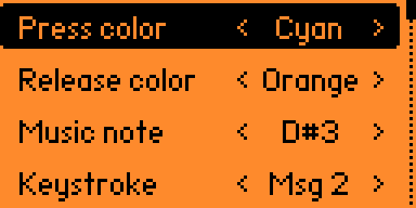
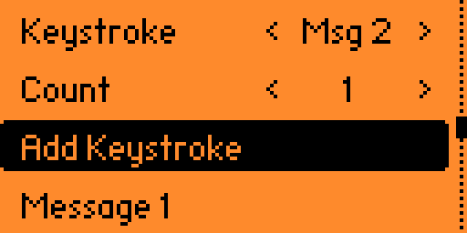

# FlipKeyboard

- [Overview](#overview)
- [Configuration](#configuration)
- [Running the app](#running-the-app)
- [Tutorials](#tutorials)
  - [Video tutorials](#video-tutorials)
  - [Written tutorials](#written-tutorials)

## Overview

The FlipKeyboard application turns your Flipper Zero into a musical, light-up keyboard, that connects via USB to a computer. It uses the FlipBoard to provide the keys and the LEDs. The application is written in C and uses the flipboard common code for the majority of the functionality.

## Configuration

Go to "Config" in the app menu to set up the buttons. You’ll see different key combos. Use the "up" and "down" buttons to scroll. Press "ok" to pick one. Press "back" to return to the main menu.

The "Color up" option changes the button color when it’s not pressed. This option doesn’t work for combo buttons.

The "Color down" option changes the button color when it’s pressed. If you pick a combo button, all the buttons in that combo will change color.

The "Frequency" option changes the sound to play when the button is pressed. You can pick "Off" if you don’t want a sound.

The "Message" option changes the text to send to the computer when the button is pressed. If you want to erase a message, press Space. This is a fix for the current keyboard widget.

The "Add Keystroke" option adds an additional "Keystroke" and "Count". The Keystrokes will be performed before the Message is sent. The keys "Ctrl", "Shift", "Alt" and "Gui" are modifiers that will stay pressed until the next key.  The Count is how many times to press the key. 

You can pick the key from an on-screen keyboard. Press "ok" to while a "Keystroke" is selected to pick a key. Press "back" to cancel.

NOTE: For this demo, not all keys are on the on-screen keyboard; you may need to use "left" and "right" buttons on the "Keystroke" option to access some keys.

## Running the app

Make sure your FlipBoard is connected to your Flipper Zero.  Choose the "Flipboard Keyboard" option to launch the app.  You should see the FlipBoard LEDs do their start-up sequence.  Press the buttons to see the LEDs change color & hear the tones get played.  If your computer is connected to your Flipper Zero, you should see keystrokes and Messages get entered on the computer.

## Tutorials

### Video tutorials

 [Flipper Zero: Customizing the FlipKeyboard app](https://www.youtube.com/watch?v=xCiqXHF7-Wo)

### Written tutorials

- [Learn about the file format of the configuration files](tutorials/file-format.md)
- [Edit the Message that is typed](tutorials/message.md)
