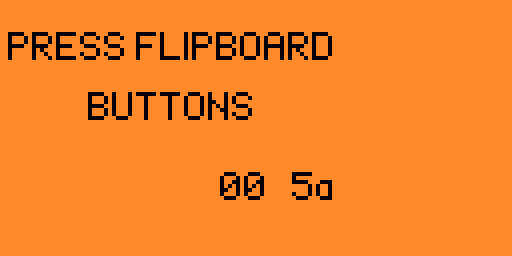

# FlipKeyboard

## Overview

The FlipKeyboard application turns your Flipper Zero and FlipBoard into a MacroPad Keyboard.  It also becomes a musical light-up keyboard that you can use to play songs. It supports both USB *and* BLE connections. Automate repetitive typing tasks with the press a button on the FlipBoard! The application is written in C and uses the FlipBoard common code for the majority of the functionality.

You can order your FlipBoard from [@MakeItHackin](https://www.youtube.com/makeithackin) using [tindie](https://www.tindie.com/products/32844/) or [Etsy](https://www.etsy.com/listing/1601295558/).  Be sure to also join our [Discord server](https://discord.gg/KTThkQHj5B).

- [Running the app](#running-the-app)
- [Configuration](#configuration)
- [Using the app](#using-the-app)
  - [BLE support](#ble-support)
- [Tutorials](#tutorials)
  - [Video tutorials](#video-tutorials)
  - [Written tutorials](#written-tutorials)
- [Updates](#updates)
- [Support](#support)

## Running the app

Make sure your FlipBoard is connected to your Flipper Zero.  On your Flipper Zero, press the `Ok` button.  Scroll down to `Apps` and click the `Ok` button.  Select the `GPIO` folder.  Select the `FlipBoard Keyboard` application. You should see startup splash screen for a few seconds reminding you to connect the FlipBoard and then the FlipBoard LEDs will do their start-up sequence.

## Configuration

Go to `Configure application` in the app menu to setup how each action works. You’ll see all of the different button combos listed (for example "Action 3" is pressing button 1 and button 2 at the same time). Press `Ok` to select the Action to configure.

The `Press color` option changes the button color when it’s pressed. If you pick a combo button, all the buttons in that combo will change color.

The `Release color` option changes the button color when it’s not pressed. This option doesn’t work for combo buttons.

The `Music note` option changes the sound to play when the button is pressed. You can pick `Off` if you don’t want any sound.

 

The `Keystroke` option adds a key to press when the button is pressed. You can pick `None` if you don’t want any key to be pressed.  There is also options `Msg1`, `Msg2`, `Msg3`, `Msg4` which will type the message you have set in the "Message 1-4" option.  The option `Delay` will pause for 100ms. The keys `Ctrl`, `Shift`, `Alt` and `Gui` are modifiers that will stay pressed until the next key.  If you press `Ok` on the Keystroke, you will get a custom keyboard to pick the key. You can press `Back` if you decide to not change the key.

NOTE: For this application, not all keys are on the on-screen keyboard; you may need to use the Flipper Zero's `Left` and `Right` buttons on the "Keystroke" option to access some keys options.

NOTE: You can remove a Keystroke by selecting `None` as the key.  Currently this change only takes effect after you quit the application and restart it.  In a future version, this will take effect when you go to the application main menu.

The `Count` is how many times to press the key (or repeat the delay). 

The "Message 1-4" option changes the text to send (NOTE: you should also use "Add Keystroke" and choose `Msg1`-`Msg4` to send the message). If you want to erase a message, replace the message with a Space then press save.

## Using the app

Make sure your FlipBoard is connected to your Flipper Zero.  Make sure the qFlipper application is NOT running. Choose the `Start application` option to launch the app.  Press the buttons to see the LEDs change color & hear the tones get played. If your computer is connected to your Flipper Zero via USB, you should see keystrokes and Messages get entered on the computer.  If you computer is NOT connected to your Flipper Zero via USB, then BLE will be used to send the keystrokes and Messages to the computer.

### BLE support
To enable BLE, make sure no applications are running on the Flipper Zero.  Then go to `Settings`, `Bluetooth` and select `On`.  You can also choose `Unpair All Devices` from this menu.

To pair a BLE device, run the `FlipKeyboard` application on the Flipper Zero.  Make sure the USB cable is NOT plugged in, then choose `Start application`.  On your device (phone, computer, etc.) choose Bluetooth pairing.  The device should show up as `BadUSB <flipper name>`.  On your Flipper confirm the pairing code is correct and click `Ok`, then click confirm on your device.  The device should now be paired.

## Tutorials

### Video tutorials

 [Flipper Zero: Customizing the FlipKeyboard app](https://www.youtube.com/watch?v=xCiqXHF7-Wo)

### Written tutorials

- [Advanced data entry](tutorials/advanced-data-entry.md)
- [Play a song; Happy Birthday / Jingle Bells!](tutorials/song.md)
- [Learn about the file format of the configuration files](tutorials/file-format.md)
- [Edit the Message that is typed](tutorials/message.md)
- [Write a custom button action for when button 3+4 are pressed](tutorials/custom-button-action.md)
- [Change a Keystroke button](tutorials/swap-keystroke-button.md)
- [Add a new Keystroke row](tutorials/add-keystroke-row.md)
- [Add a new startup sequence](tutorials/led-startup-sequence.md)

## Updates

- Version 3.6 : Show "BLE" or "USB".
- Version 3.5 : Show FlipKeyboard title when app is running.
- Version 3.4 : Don't send MSG1-4 if Keystroke is set to any key.
- Version 3.3 : Add support for BLE.
- Version 2.6 : Default configuration on first load.
- Version 2.5 : Splash screen.
- Version 2.4 : Improved LED driver.
- Version 2.3 : Add additional keystroke buttons.

## Support

If you have need help, we are here for you.  Also, we would love your feedback on cool ideas for future FlipBoard applications!

Please visit my Flipper Zero Discord server [Flipper Zero Tutorials (Unofficial)](https://discord.gg/KTThkQHj5B) and ask your questions in the `#flipboard` or `#general` channel.
