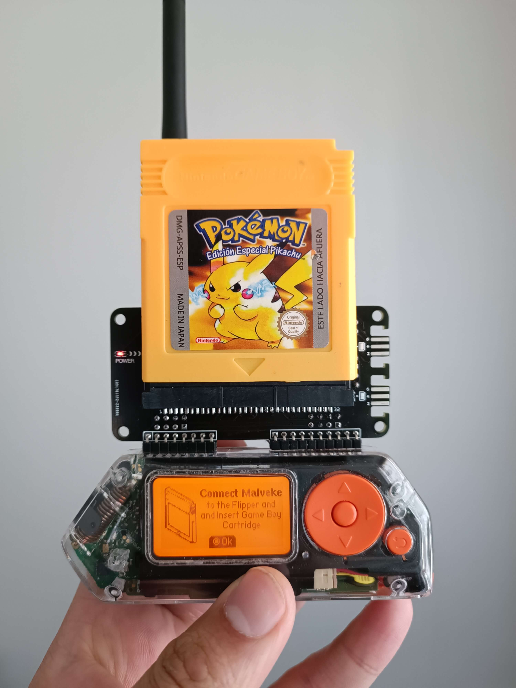
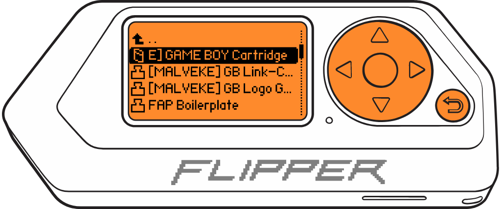

# ***GAME BOY*** Cartridge (GB/GBC) MALVEKE

<figure>
    
    <figcaption>MALVEKE Prototype V2.3</figcaption>
</figure>

## Introduction

**Official** | **Unleashed** | **RogueMaster** | **Xtreme**
:- | :- | :- | :- 
|||

 

https://github.com/EstebanFuentealba/MALVEKE-Flipper-Zero/assets/442927/a1d06e1f-5626-4a67-b058-24ff8f24eaf6

## Features
- Read info from GAME BOY/GAME BOY Color Cartridges
- Backing up and restoring your saves (RAM)
- Backing up and restoring your games (ROM) (WIP)

## Instructions for use.

These instructions assume that you are starting at the Flipper Zero desktop. Otherwise, press the Back button until you are at the desktop.

- Disconnect the Flipper Zero from the USB port if you are currently using it.
- Press the `OK` button on the Flipper to open the main menu.
- Choose `Applications` from the menu.
- Choose `GPIO` from the submenu.
- Choose `GAME BOY Cartridge (GB/GBC) MALVEKE`

    

         
        
         
    

- If the **MALVEKE** board and the cartridge are connected, The Flipper Zero will show the loading screen of the application.

    

         
        
         
    

- Press the `OK` to enter to menu.

    

         
        
         
    

    
    - Select `Cartridge Information` to view details about the inserted cartridge.

    
    

         
        
         
    

    - Select `Dump ROM Cartridge` to create a complete backup of the game into a file. This file will be saved in the directory `SD Card/apps_data/malveke/roms` and can be loaded into GAME BOY emulators.

    

         
        
         
    

    - Choose `Dump RAM Cartridge` to create a backup of the game state, which stores the progress of a specific video game. This file will be saved in the directory `SD Card/apps_data/malveke/rams`.

    

         
        
         
    

- Press the `Back` to back to principal menu.

 
 
From Talcahuano 🇨🇱 with ❤ 

