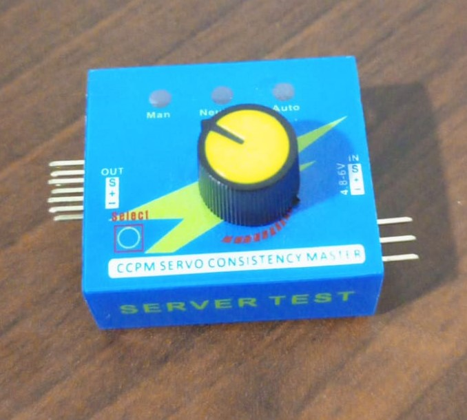

# Servo tester app for Flipper Zero

https://user-images.githubusercontent.com/8887221/228034391-aa9df44c-dcf7-4999-9d22-590cc7ac0392.mp4

The aim of this app is to replicate the behavior from this tester:

You can read more about it in this blog ! link to blog here

## Usage

- Connect Servo control line to `A7` pin.
- Start app
- If you're supplying power from a power source, make sure it have common ground with the flipper.

## Controls

- Left/Right: change angle in manual mode.
- Up/Down: change mode

The app have three modes:

- Manual: left increase 10°, right dcreace 10°.
- Center: move to 90°.
- Sweep: move between 0° & 180° every 1 second.

Angle range is: 0° to 180°.

## Installing

Drop the `servotester.fap` from `./binaries` to `/ext/apps/GPIO/`.

## Building

- Navigate to your firmware directory > `./application_user`
- copy `servotester/` content.
- run `./fbt launch_app APPSRC=servotester`
