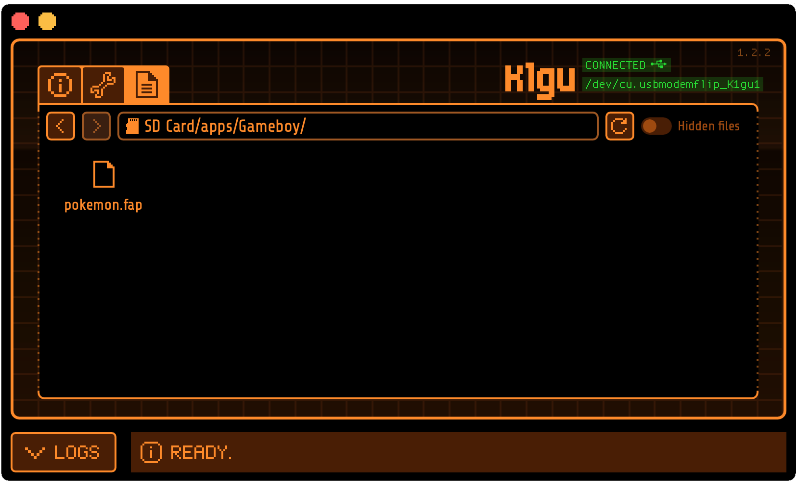
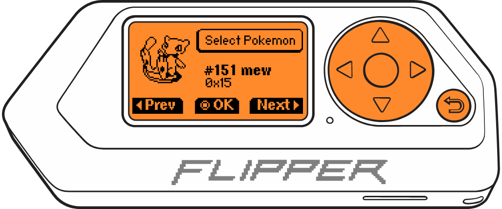
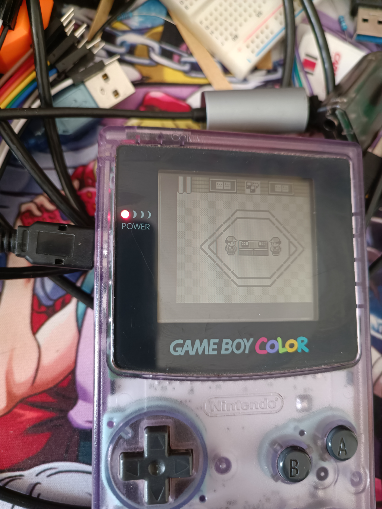
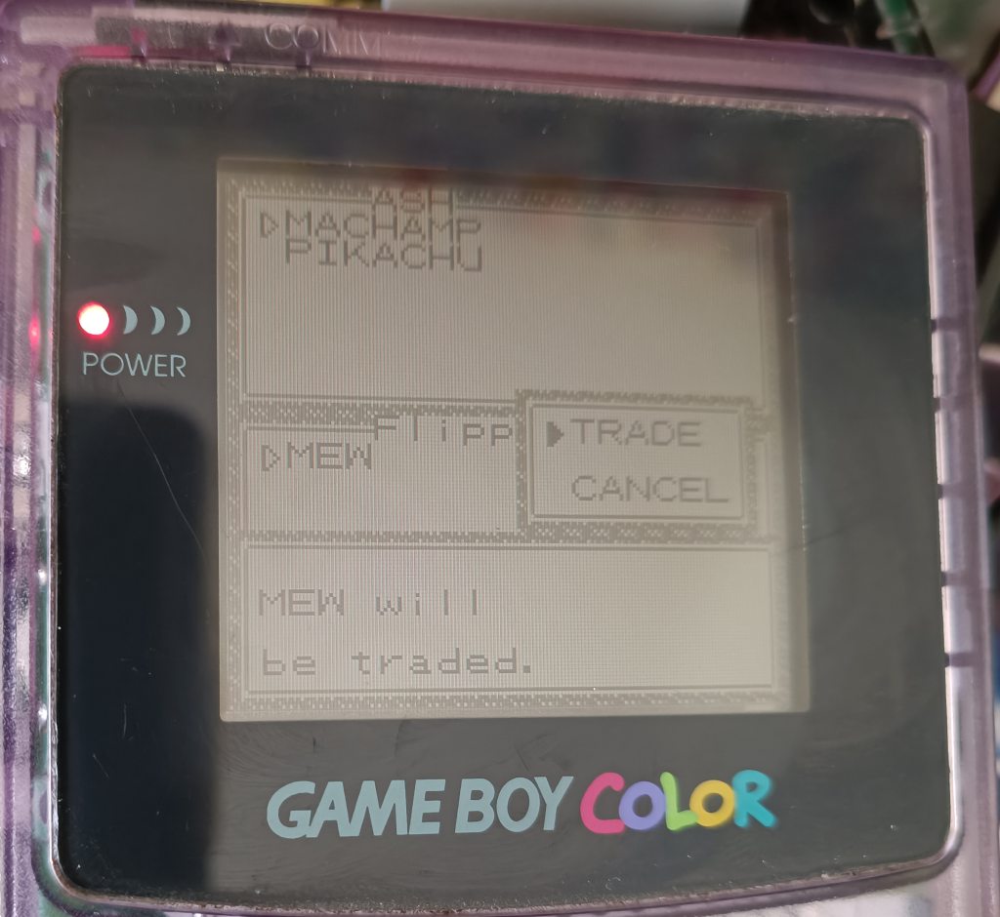
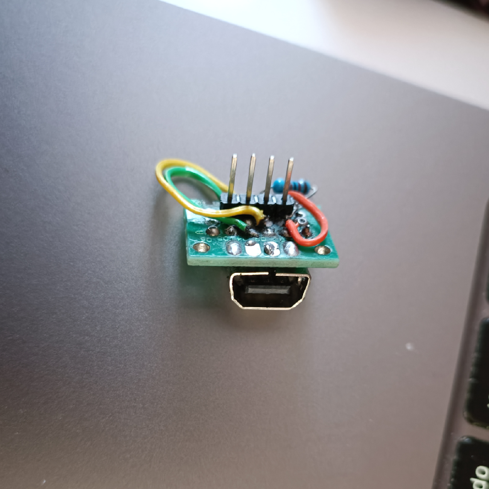

# 🐬 Flipper Zero - Pokemon Trading in Game Boy

<p align="center">
<a target="_blank" href="https://www.reddit.com/r/flipperzero/comments/121ncot/flipper_zero_game_boy_pokemon_trading/">
  
  </a>
  <br />
</p>

<div align="center">

**FW Official** | **FW Unleashed** | **FW RogueMaster**
:- | :- | :- 
[](https://flipc.org/EstebanFuentealba/Flipper-Zero-Game-Boy-Pokemon-Trading?branch=main)|[](https://flipc.org/EstebanFuentealba/Flipper-Zero-Game-Boy-Pokemon-Trading?branch=main&firmware=unleashed)|[](https://flipc.org/EstebanFuentealba/Flipper-Zero-Game-Boy-Pokemon-Trading?branch=main&firmware=roguemaster)
</div>

## Introduction

This is a Pokemon exchange application from Flipper Zero to Game Boy [(Generación I)](https://bulbapedia.bulbagarden.net/wiki/Generation_I). Flipper Zero emulates a "Slave" Game Boy connected to a Game Link Cable to be able to exchange any Pokemon from the First Generation (Red, Blue, Yellow) to a real Game Boy.

It is a Proof of Concept (POC) for using views, GPIO, and FURI (Flipper Universal Registry Implementation).

## Installation Directions

This project is intended to be overlayed on top of an existing firmware repo,  in my case the **Release 0.79.1** version.

- Clone the [Flipper Zero firmware repository](https://github.com/flipperdevices/flipperzero-firmware). Refer to [this tutorial](https://github.com/jamisonderek/flipper-zero-tutorials/tree/main/firmware/updating/README.md) for updating the firmware.
- Copy the "pokemon" folder into the `/applications_user/pokemon` folder in your firmware.
- Run the command `fbt launch_app` to run it on your Flipper Zero.

```bash
./fbt launch_app APPSRC=pokemon
```

- NOTE: If you only want to generate the fap file, you must run the following command.

```bash
./fbt fap_pokemon
```

And use [**qFlipper**](https://flipperzero.one/update) to copy the generated **pokemon.fap** file to the `SD Card/apps/Game Boy` folder.

<p align='center'>
<br />
</p>

## Instructions for use.

These instructions assume that you are starting at the Flipper Zero desktop. Otherwise, press the Back button until you are at the desktop.

- Press the `OK` button on the Flipper to open the main menu.
- Choose `Aplicaciones` from the menu.
- Choose `Game Boy` from the submenu.
- Choose `Pokemon Trading`
- The Flipper Zero should show the selection of Pokemon that you want to trade, and by default, it appears as bulbasaur.

    <p align='center'>
        <br />
        
        <br />
    </p>

- Press the `LEFT`/`RIGHT` buttons to paginate the selection of Pokemon by 1.
- Press the `UP`/`DOWN` buttons to paginate the selection of Pokemon by 10.
- Press the `OK` button to select the Pokemon to trade.
    <p align='center'>
         <br />
        <br />
    </p>
- The Flipper Zero will display the view to connect the Game Boy.
    <p align='center'>
        <br />
        <br />
    </p>
- On your Game Boy, you should connect the  **Game Link Cable** to the Game Boy and in the game, go to the nearest  **Pokemon Center**.
    <p align='center'>
        <br />
        <br />
    </p>
- Talk to the girl at the counter on the right. The girl will tell us that we have to save the game before playing, we will answer **YES** by pressing the **A** button.

.
    <p align='center'>
        <br />
        <br />
    </p>
- The Flipper Zero will show that we are connected.
    <p align='center'>
        <br />
        <br />
    </p>
- On the Game Boy, we will be asked which option we want, and we select **TRADE CENTER**.
    <p align='center'>
        <br />
        <br />
    </p>
- You will enter the Trade Center where you must press the A button on the Game Boy on your side of the table.
    <p align='center'>
        <br />
        <br />
    </p>
- Flipper Zero will remain on a waiting screen with the Pokemon you selected.
    <p align='center'>
        <br />
        <br />
    </p>
- You will see your Pokemon and the Pokemon you selected on the Flipper Zero, in this case, `Mew`. You must select the Pokemon you want to trade and press **TRADE**.
    <p align='center'>
        <br />
        <br />
    </p>
- You must confirm the selected trade by selecting **TRADE**.
    <p align='center'>
        <br />
        <br />
    </p>
- Flipper Zero will remain on a waiting screen with the Pokemon you selected.
    <p align='center'>
        <br />
        <br />
    </p>
- Finally, the Pokemon exchange will start from **Flipper Zero** to the **Game Boy**.
    <p align='center'>
        <br />
        <br />
    </p>

    If the Flipper Zero gets stuck at the end of the exchange, you must reboot it by pressing the  LEFT +  BACK key combination.
    <p align='center'>
        <br />
        <br />
    </p>

## How does it work?

The method used to communicate 2 Game Boys is based on the SPI protocol, which is a very simple serial communication protocol in which a master device communicates with one or more slave devices. The protocol is bidirectional and synchronous, and uses three basic signals:

- A clock signal (CLK).
- An output signal (Serial Out or SO).
- An input signal (Serial In or SI).

In the Game Boy, games store data in an internal shift register that is used to send and receive information. The SPI protocol used by the Game Boy uses the clock signal to indicate when data is being transferred.

The Game Boy link protocol is synchronous and requires the slave device to respond at the same rate as the master device. The master device supplies an 8KHz clock (data transfer rate of 1KB/s). The time window for responding is only **~120μs**. However, the slave device has no restrictions and can respond when it receives data. The clock can vary and there is no lower limit.

<p align='center'>
<br />
<br />
</p>

_An example GB SPI transfer. Here, the master sends 0xD9 (217) and the slave sends 0x45 (69)._

<br />

You can learn more about it in the following video. [**Analyzing the Different Versions of the Link Cable**](https://youtu.be/h1KKkCfzOws?t=151).

## Board for Flipper Zero with PortData EXT Link.

For the Flipper Zero board, a [PortData EXT Link](https://es.aliexpress.com/item/1005004116983895.html) and a 2x8  [prototype board](https://es.aliexpress.com/item/32478242317.html) were used.

<p align='center'>
<br />
<br />
</p>

_PortData EXT Link for Game Boy Color, Game Boy Pocket, GBC, GBP, GBL._

<p align='center'>
<br />
<br />
</p>
<p align='center'>
<br />
<br />
</p>
I used 33kΩ resistor on CLK, but it's optional, it can be connected directly.


## Connection: Flipper Zero GPIO - Game Boy

The pins should be connected as follows:

<p align='center'>
<br />
<br />
</p>

<picture>
    <source media="(prefers-color-scheme: dark)" srcset="./docs/images/GPIO-GBPIN_light-v2.png">
    <source media="(prefers-color-scheme: light)" srcset="./docs/images/GPIO-GBPIN-v2.png">
    
</picture>

| Cable Game Link (Socket) | Flipper Zero GPIO |
| ------------------------ | ----------------- |
| 6 (GND)                  | 8 (GND)           |
| 5 (CLK)                  | 6 (B2)            |
| 3 (SI)                   | 7 (C3)            |
| 2 (SO)                   | 5 (B3)            |

## Connect to Flipper Zero without Socket PortData EXT Link

It's possible to cut a cable directly without using a socket, but it's important to note that the cable is a crossover cable SI-SO.

<p align='center'>
<br />
<br />
</p>

*"Cable Game Link" cut and directly connected to the Flipper Zero pins.*

**NOTE**: Don't rely on the cable colors as they may vary depending on the manufacturer. Use a multimeter to measure continuity and identify which cable corresponds to each pin.


## GUI

To generate the graphical interface, the [**FUI-Editor**](https://ilin.pt/stuff/fui-editor/) tool was used. Additionally, the original sprites from the game Pokemon Yellow, which are found in the [**Disassembly of Pokemon Yellow**](https://github.com/pret/pokeyellow/tree/master/gfx/pokemon/front) repository, were used.

For each image, the color `#aaa` was transformed to `#fff` so that Flipper Zero would render it correctly. To do this, a batch process was used in [Photopea](https://www.photopea.com/), the online image editor.

##  Tested In
- Game Boy Color (GBC)
- Game Boy Advance (GBA)

## Implemented by
<a href="https://github.com/EstebanFuentealba/Flipper-Zero-Game-Boy-Pokemon-Trading/issues?q=is%3Aissue+label%3AImplemented+is%3Aclosed+is%3Aopen+" target="_blank"></a>

## TODO
- [ ] Refactor the code
- [x] The OK button stops working when exiting the app, so it needs to be restarted 🤔
- [ ] Set each Pokemon's characteristics, attacks, and default levels
- [ ] Improve animations

## Links

- [Flipper Zero firmware source code](https://github.com/flipperdevices/flipperzero-firmware)
- Adan Scotney's pokemon [trade protocol specification](http://www.adanscotney.com/2014/01/spoofing-pokemon-trades-with-stellaris.html) and implementation
- Derek Jamison - [Youtube Channel](https://www.youtube.com/@MrDerekJamison)
- Matt Penny - [GBPlay Blog](https://blog.gbplay.io/)
- [Pokémon data structure (Generation I)](<https://bulbapedia.bulbagarden.net/wiki/Pok%C3%A9mon_data_structure_(Generation_I)>)
- [Disassembly of Pokemon Yellow](https://github.com/pret/pokeyellow)
- [Arduino-Spoofing-Gameboy-Pokemon-Trades](https://github.com/EstebanFuentealba/Arduino-Spoofing-Gameboy-Pokemon-Trades)
- [🎮 Gameboy link cable breakout PCB](https://github.com/Palmr/gb-link-cable)

<p align='center'>
<br />
<br />
From Talcahuano 🇨🇱 with ❤ 
</p>
