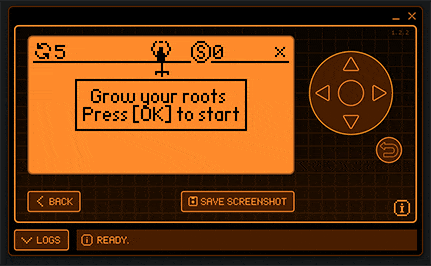

# Root of Life

A zen-puzzle game for [FlipperZero](https://flipperzero.one/) puzzle made on [GlobalGameJam'23](https://globalgamejam.org/2023/games/roots-life-9) (theme: "Roots")

Nothing interesting in the code, as you would expect from a jam-rushed development. Was just curious about making a custom app for the device

## Gameplay

### Rules

There is no strict goal, but the idea is to grow the root by connecting new section to existing ones to take larger area of the screen. Collecting "water" (spinning dots) gives extra points.

Roots are generated and moved within 3x3 cells, so not all positions would be available, ✔️ or ❌ in the top-right corner show if current placement is correct. You can "reroll" the root to try a new one. Rerolls are limited, and the game is over when you are out of rerolls.

### Controls

- `OK` to start the game
- `Arrows` to move the root
- `OK` to either place the root if possible or reroll it otherwise
- `Back` to quit

## Installation

Go to [Releases](https://github.com/Xorboo/root-of-life/releases), download `.fap` file, and put it into `apps/Games` directory on your SD-card

## Development

To work on the code look into [flipperzero-firmware documentation](https://github.com/flipperdevices/flipperzero-firmware/blob/dev/documentation/AppsOnSDCard.md#how-to-set-up-an-application-to-be-built-as-a-fap)

---

## TODO

_(no, nothing of that will ever be done)_

- Code cleanup
- Sounds
- Highscores (if I can figure out how to IO)
- Tiny grass sine-based animation over the ground
- Infinite scrolling field (?)

## Funzies

- [Timelapse](https://youtu.be/yM8CcmQ7kqQ) of coding and presenting the game
- Game icons were made in Paint (one of the possible jam diversifiers, and not like i needed anything else there really)
