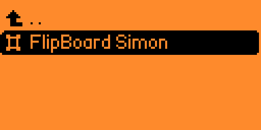
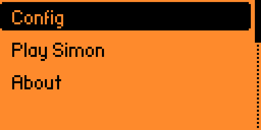
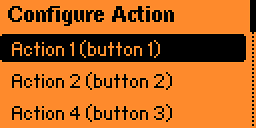
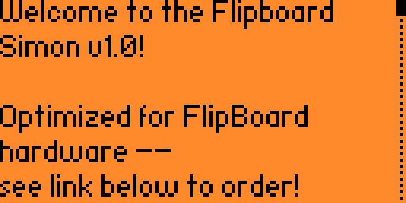

# Simon for FlipBoard

## Introduction
The FlipBoard is a device that lets you create your own Simon memory game. Simon is a game where you have to remember and repeat a sequence of button presses. Each button has a different color and sound. The game starts by showing you one button press. You have to press the same button. Then the game adds another button press to the sequence. You have to press both buttons in the same order. The game keeps adding more button presses until you make a mistake or finish the song. This guide will show you how to build and play the game using the FlipBoard.

This guide is written with extensive details. You should be able to successfully create the game _without_ needing to read any of the **VSCODE**, **C LANGUAGE**, **FLIPPER CODE**, **FLIPBOARD CODE**, or **SIMON CODE** sections. Feel free to bypass any topics that don't apply to you. 

- **VSCODE**: Covers concepts related to the Visual Studio Code development environment.
- **C LANGUAGE**: Covers concepts related to the C programming language, which is the language we use for Flipper applications.
- **FLIPPER CODE**: Covers concepts specific to the functions provided by the Flipper Zero libraries.
- **FLIPBOARD CODE**: Covers concepts specific to the common code provided by the FlipBoard.
- **SIMON CODE**: Covers concepts specific to the code we are developing.

NOTE: Concepts are only explained the first time it applies in the document, so you may need to scroll to a previous section for clarification.  You can use [Bing Chat](https://chat.bing.com) for more detailed understanding of the C language. For example, you can ask `what does #include do in c?` and it can provide a detailed explanation and answer follow-up questions.

## Hardware Prerequisites
* Flipper Zero - order from [Flipper](https://shop.flipperzero.one/)
* FlipBoard - order from [MakeItHackin](https://github.com/MakeItHackin/FlipBoard)
* USB cable - included with Flipper Zero

## Environment Prerequisites
Ensure your build environment is correctly set up by following the steps outlined in [Building with VS Code](https://github.com/jamisonderek/flipboard/blob/main/README.md#building-with-vscode-visual-studio-code). It's crucial to have a functional build environment before proceeding. This tutorial involves copying common code from an existing project, so you'll also need to clone the flipboard tutorial.

## Steps
Click on any step to see all of the detailed instructions for that step.

Each step (up to step 7) of this tutorial has a corresponding directory in the [completed directory](./completed/README.md). If you have read and understood the first seven steps, feel free to copy the files from the `step-07` directory into your own project and continue from there. You will want to redo **step 1e**, edit the `fap_author` and `fap_weburl` entries.

- [Step 1. Create a new `flipsimon` project](#step-1-create-a-new-flipsimon-project)
- [Step 2. Setup basic FlipBoard project](#step-2-setup-basic-flipboard-project)
- [Step 3. Create the startup sequence](#step-3-create-the-startup-sequence)
- [Step 4. Draw message (Press OK to play)](#step-4-draw-message-press-ok-to-play)
- [Step 5. Add game state to the model](#step-5-add-game-state-to-the-model)
- [Step 6. Allow user to start new game](#step-6-allow-user-to-start-new-game)
- [Step 7. Handle the `Back` button](#step-7-handle-the-back-button)
- [Step 8. Turn the FlipBoard lights on (dim)](#step-8-turn-the-flipboard-lights-on-dim)
- [Step 9. Generate a song](#step-9-generate-a-song)
- [Step 10. Teach the notes to the user](#step-10-teach-the-notes-to-the-user)
- [Step 11. Allow player turn to repeat the notes](#step-11-allow-player-turn-to-repeat-the-notes)
- [Step 12. Check if the user pressed the correct button](#step-12-check-if-the-user-pressed-the-correct-button)
- [Step 13. Tell the user if they won or lost](#step-13-tell-the-user-if-they-won-or-lost)
- [Step 14. Create special ending for a lost game](#step-14-create-special-ending-for-a-lost-game)
- [Step 15. Create special ending for a won game](#step-15-create-special-ending-for-a-won-game)
- [Step 16. Change the speed of the song (and add more notes)](#step-16-change-the-speed-of-the-song-and-add-more-notes)
- [Congratulations!](#congratulations)

## Step 1. Create a new `flipsimon` project
The `flipsimon` project serves as the primary project for the Simon game. Initially, the project will consist of an application that exits immediately. As we progress through the steps, we will incrementally enhance the project with additional functionalities.

### Step 1a. Create a `flipsimon` folder for the project
- Open Visual Studio Code.
- Right click on `applications_users` folder.
- Choose `New Folder...`
- Type `flipsimon` and press `Enter`.
- You should see "> flipsimon" in the Explorer pane.  If you see lines lines to flipsimon instead of an arrow, delete flipsimon and try again, verifying you picked `New Folder...`.

### Step 1b. Copy `flipblinky.png` and rename to `flipsimon.png`
The `flipsimon.png` will be the icon that shows in the App menu on the Flipper Zero.
- Open the `flipblinky` folder from the tutorials.
- Right click on `flipblinky.png` and choose `Copy`.
- Right click on the `flipsimon` folder and choose `Paste`.
- Right click on the newly pasted `flipblinky.png` and choose `Rename`.
- Type `flipsimon.png` and press `Enter`.

### Step 1c. Edit the `flipsimon.png` image
We will use the `Luna Paint - Image Editor` extension to edit the image.
- On the left side of Visual Studio Code, click on Extensions.
- Search for `Luna Paint - Image Editor`.
- Click on `Install`.
- On the left side of Visual Studio Code, click on Explorer.
- Open the `flipsimon.png` file.
- Edit the image (creating a black and white 10x10 pixel PNG image).
- NOTE: You can use left click to set a pixel and right click to clear a pixel.
- NOTE: You can use CTRL+scroll wheel to zoom out, which may be helpful.
- Save the image

### Step 1d. Copy the `application.fam` from the `flipblinky` tutorial
- Open the `flipblinky` folder.
- Right click on `application.fam` and choose `Copy`.
- Right click on the `flipsimon` folder and choose `Paste`.

### Step 1e. Edit the `application.fam` file
The `application.fam` file is a JSON formatted text file that contains the information about the application.
- Set the `appid` to `flipboard_simon`.  This is the unique identifier for the application.  It must be unique across all applications. Lowercase letters, numbers and underscores are allowed. 
- Set the `name` to `FlipBoard Simon`.  This is the name that will show in the App menu on the Flipper Zero.
- Set the `entry_point` to `flipboard_simon_app`. This is the name of the function that will be called when the application is started.
- Set the `fap_version` to `(1, 0)`.  This is the version of the FAP (Flipper Application Protocol).  You should increase this number whenever you release new features.
- Set the `fap_icon` to `flipsimon.png`.
- Set the `fap_category` to `Games`.
- Remove the `fap_icons_assets` entry if it exists.  This is the folder where PNG files will get converted into Icon and IconAnimation assets.  We will not be using this feature in this tutorial.
- Edit the `fap_description` to `Simon memory game for the FlipBoard`.  You can enter any description you would like.
- You can also add `fap_author` and `fap_weburl` entries it you want, as described in the [AppManifest.md file](https://github.com/flipperdevices/flipperzero-firmware/blob/dev/documentation/AppManifests.md)
- Save the `application.fam` file.

### Step 1f. Create a new `app.c` file
- Right click on the `flipsimon` folder and choose `New File`.
- Type `app.c` and press `Enter`.

### Step 1g. Add `fliboard_simon_app` entry point to `app.c`
Add the following code to the `app.c` file, then save the file:

```c
#include <furi.h>

/**
 * @brief This is the entry point of the application.
 * @details The application.fam file sets the entry_point property to this function.
 * @param p Unused parameter.
 * @return int32_t Returns a 0 for success.
 */
int32_t flipboard_simon_app(void* p) {
    UNUSED(p);

    return 0;
}
```

- **FLIPPER CODE**: The statement `#include <furi.h>` brings in the Flipper Universal Registry Implementation, which provides essential definitions for Flipper Zero programming. As we advance in this tutorial, we will add more `#include` statements. The `furi.h` file resides in the `furi` directory, which is included in the search path.
- **C LANGUAGE**: You can think of the `#include` statement as a command to copy and paste the content of the specified file. This statement is a preprocessor directive, meaning it's processed before the compiler interprets the code. If the file name is enclosed in `<>`, the preprocessor searches for the file in the include search path. If it's enclosed in `""`, the preprocessor looks for the file in the current directory.

- **C LANGUAGE**: The compiler treats everything between `/*` and `*/` as a comment, ignoring it during compilation. Similarly, `//` initiates a single-line comment, causing the compiler to ignore everything following it on the same line. Note: While compilers disregard comments, AI assistants like GitHub Copilot use them to better understand the code's purpose. You can enhance documentation by using additional markup such as `@brief`, `@details`, `@param`, and `@return`.

- **FLIPPER CODE**: `int32_t` represents a 32-bit signed integer, which can hold both positive and negative values. In contrast, unsigned integers such as `uint32_t` can only hold positive values (and zero). The range of a 32-bit signed integer is from -2,147,483,648 to 2,147,483,647.
- **C LANGUAGE**: `flipboard_simon_app` is the function's name. Parentheses `()` follow the function name and are used to pass parameters to the function. Curly braces `{}` define the function's scope, which is the area where the function's code resides. The function's name corresponds to the `entry_point` in the `application.fam` file, which is the function the Flipper Zero will execute when the application starts.
- **C LANGUAGE**: `void* p` represents the function's parameter list. `void*` is the parameter's type, indicating a pointer to an unspecified type. `p` is the parameter's name, serving as a local variable accessible only within the function's scope.

- **FLIPPER CODE**: The `p` is not used in this function, so it is marked as `UNUSED`.  The `UNUSED` macro is defined in `furi.h` and is used to prevent compiler warnings about unused variables.

- **C LANGUAGE**: `return 0;` is the return statement for the function.  The `return` statement is used to return a value from the function.  The `0` is the value that is returned from the function.  The `0` is the return code for the function.  A return code of `0` from this function means that the function completed successfully.  Functions must return a value at the end of the function.

### Step 1h. Run the application


- Make sure you save app.c & any other files you edited.
- Make sure qFlipper is not running & no CLI is running.
- Make sure no applications are running on the Flipper Zero.
- Make sure Flipper Zero is plugged into the computer.
- Press Control+Shift+B
- Choose `[Debug] Launch app on Flipper`

If you get an error message displayed in red, read it out loud and hopefully there will be a clue as to the issue.  If you can't figure it out, ask for help in the [Discord server](https://discord.com/invite/NsjCvqwPAd).  If it just says `***FBT Errors***` check to see if the text a few lines above has the message `“sections requires a defined symbol root specified by -e or -u”`.  If so, you need to confirm that the entry_point value in `application.fam` file matches the name of the method in `app.c` (the casing must be identical).  If you still can't figure out the error, you may want to compare your code with the code in the completed files.

NOTE: The application doesn't actually do anything, so it will run and then immediately exit.

NOTE: You should now be able to find the application on your Flipper Zero!  Navigate to `App` menu, then choose the `Games` category.  You should see the `FlipBoard Simon` application (set by the name property in the application.fam file).  If you click on the application, it will run and then immediately exit.

## Step 2. Setup basic FlipBoard project
The fundamental FlipBoard project will include a menu, a Configuration screen, an About screen, and a "Play Simon" screen. For the time being, the "Play Simon" screen will remain empty.

### Step 2a. Copy the `common` folder from the `flipblinky` tutorial
- Open the `flipblinky` folder.
- Right click on the `common` folder and choose `Copy`.
- Right click on the `flipsimon` folder and choose `Paste`.

### Step 2b. Copy the `app_config.h` file from the `flipblinky` tutorial
- Open the `flipblinky` folder.
- Right click on the `app_config.h` file and choose `Copy`.
- Right click on the `flipsimon` folder and choose `Paste`.

### Step 2c. Edit the `app_config.h` file
- Change the `TAG` to `"FlipBoardSimon"`.  This TAG is used for logging messages.
- Change the `FLIPBOARD_APP_NAME` to `"simon"`.  The FLIPBOARD_APP_NAME is used for saving the application settings.
- Change the `FLIPBOARD_PRIMARY_ITEM_NAME` to `"Play Simon"`.  This is the name that will show in the the applications menu.
- Delete the line `#define FIRMWARE_SUPPORTS_SUBGHZ 1`.  This is not needed for this application, since we do not use the SUBGHZ radio.
- Change the `ABOUT_TEXT`.  This is the text that will display in the About dialog. Each line must end with a '\' character to continue to the next line.  The last line must not have a '\' character. Put the text in quotes.  A `\n` will create a new line.
- Save the file.

### Step 2d. Replace the contents of the `app.c` file
**Replace** the entire contents of the `app.c` file with the following code:

```c
#include <furi.h>
#include <gui/view.h>
#include "app_config.h"
#include "./common/flipboard.h"

/**
 * @brief Returns a View* object.
 * @details Returns a View* object, configured with default settings.
 * @param context Unused parameter.
 * @return View* The view* object.
 */
static View* get_primary_view(void* context) {
    UNUSED(context);
    return view_alloc();
}

/**
 * @brief This is the entry point of the application.
 * @details The application.fam file sets the entry_point property to this function.
 * @param p Unused parameter.
 * @return int32_t Returns a 0 for success.
 */
int32_t flipboard_simon_app(void* p) {
    UNUSED(p);

    ActionModelFields fields = ActionModelFieldColorDown | ActionModelFieldFrequency;
    bool single_mode_button = true;

    Flipboard* app = flipboard_alloc(
        FLIPBOARD_APP_NAME,
        FLIPBOARD_PRIMARY_ITEM_NAME,
        ABOUT_TEXT,
        fields,
        single_mode_button,
        false,
        NULL,
        NULL,
        0,
        get_primary_view);

    view_dispatcher_run(flipboard_get_view_dispatcher(app));

    flipboard_free(app);

    return 0;
}
```

- **FLIPPER CODE**: The statement `#include <gui/view.h>` brings in the Flipper GUI View Implementation.  GUI stands for Graphical User Interface. The `View*` will serve as the primary view of the application during gameplay. It will manage Flipper D-Pad button inputs and the messages displayed throughout the game.

- **C LANGUAGE**: Observe that the `#include "app_config.h"` statement employs double quotes instead of angle brackets. This implies that the preprocessor will search for the file in the current directory.
- **SIMON CODE**: The statement `#include "app_config.h"` incorporates the application settings that we previously modified.

- **FLIPBOARD CODE**: The `#include "./common/flipboard.h"` statement will include the based FlipBoard Implementation files.  The FlipBoard* will be the main application object.  It will handle the application settings, the application menu, the About dialog, and the application view.

- **C LANGUAGE**: The `static` keyword, when used before a function definition, limits the function's visibility to the current file. Such a function is known as a `static function`.  It is good practice to mark all of your functions as static unless they will need to be accessed by another file.

- **SIMON CODE**: The function `View* get_primary_view(void* context)` returns a pointer to the primary View object. We allocate a View object and return it. The context parameter is currently unused. As we progress through the tutorial, we will configure this View to perform specific tasks. The function's name is passed as the final parameter to `flipboard_alloc`, informing the FlipBoard about the callback function to invoke to obtain the primary View object.

- **FLIPBOARD CODE**: `ActionModelFields fields = ActionModelFieldColorDown | ActionModelFieldFrequency;` specifies the list of fields we want to display in the action configuration screen.  
- **C LANGUAGE**: Each field represents a bit (a binary digit) and the `|` operator combines those bits together into a signal value.  Down is `00000010b`, `Frequency` is `00000100b`; so the combined value is `00000110b`.

- **C LANGUAGE**: `bool single_mode_button = true;` creates a variable named `single_mode_button` with a value of `true`.  A `bool` is a boolean value; which can be either `true` or `false`.  The `single_mode_button` is used to determine if the application should allow multiple button presses at the same time.
- **C LANGUAGE**: Variables can be named anything you want.  The name of the variable should be descriptive of what the variable is used for.
- **FLIPPER CODE**: In Flipper Zero code, variable names are typically all lowercase with underscores between words.  This is called snake case.  The variable name should be descriptive of what the variable is used for.

- **FLIPBOARD CODE**: `Flipboard* app = flipboard_alloc(...);` creates a variable named `app` and allocates a new Flipboard object.  The `flipboard_alloc` function takes many parameters.  
  - The first parameter is the name of the application.
  - The second parameter is the name of the primary menu item.
  - The third parameter is the About text.
  - The fourth parameter is the list of fields to display in the action configuration screen.
  - The fifth parameter is the single mode button.
  - The sixth parameter is true for HID keyboard, otherwise false.
  - The seventh parameter is the keystroke keyboard.  NULL means no keyboard. 
  - The eighth parameter is the shifted keystroke keyboard.  NULL means no keyboard.
  - The ninth parameter is the number of rows.  We use `0` because there are no rows. 
  - The tenth parameter is the function to call to get the primary view object.

- **C LANGUAGE**: `NULL` is a specific pointer value indicating "no reference" or "no value". Pointers are often initialized to `NULL` when they aren't currently referencing any memory location. Typically, `NULL` is equivalent to `0`.

- **FLIPBOARD CODE**: `flipboard_get_view_dispatcher(app)` returns the ViewDispatcher* for the Flipboard object.  The ViewDispatcher* is used to dispatch messages to the current View object.

- **FLIPPER CODE**: `view_dispatcher_run(flipboard_get_view_dispatcher(app));` runs the ViewDispatcher.  This will start the application and run until the application is exiting.  The remainder of the function will not be executed until the application is exiting.

- **FLIPBOARD CODE**: `flipboard_free(app);` frees the Flipboard object.  This will free all of the memory used by the Flipboard object.  It is important to free any resources you allocate.

### Step 2e. Run the application




- Make sure you save app.c & any other files you edited.
- Follow the same steps to run the application as you did in step 1 [above](#step-1h-run-the-application). 

The application should run and show the main application:
- The `Config` should show configuration for `Action 1`, `Action 2`, `Action 4` and `Action 8`.  Each action should show a setting for the `Press color` and the `Music note`.
- The `About` should show the contents of the `ABOUT_TEXT` configured in `app_config.h` file.
- The `Play Simon` should show the `View` created in the `app.c` file.  The view doesn't do anything (it's just a blank screen).  The back button isn't handled yet; so you will need to reboot the Flipper (press and hold `Back`+`Left` buttons.)

## Step 3. Create the startup sequence
The startup sequence will be the sequence of blinking lights on the FlipBoard when the application starts.

### Step 3a. Add more include statements to `app.c`
At the top of the app.c file, **replace** the include statements with the following:
```c
#include <furi.h>
#include <gui/view.h>
#include "app_config.h"
#include "./common/config_colors.h"
#include "./common/custom_event.h"
#include "./common/flipboard.h"
#include "./common/flipboard_model.h"
#include "./common/leds.h"
```

- **FLIPBOARD CODE**: The `#include "./common/config_colors.h"` statement will include the FlipBoard Config Colors Implementation.  This contains the definitions for the colors that are used in the application.

- **FLIPBOARD CODE**: The `#include "./common/custom_event.h"` statement will include the FlipBoard Custom Event Implementation.  This contains the definitions for the custom events that are used in the application.

- **FLIPBOARD CODE**: The `#include "./common/flipboard_model.h"` statement will include the FlipBoard Model Implementation.  The model represents all of the properties of your main application.  We will be extending the model in a later step.

- **FLIPBOARD CODE**: The `#include "./common/leds.h"` statement will include the FlipBoard LEDs Implementation.

### Step 3b. Register the custom event callback.
**Add** the following code in the `flipboard_simon_app` function, just before the `view_dispatcher_run` statement:
```c
    view_dispatcher_set_event_callback_context(flipboard_get_view_dispatcher(app), app);
    view_dispatcher_set_custom_event_callback(
        flipboard_get_view_dispatcher(app), custom_event_handler);
```

- **FLIPPER CODE**: The `view_dispatcher_set_event_callback_context` sets the context that is passed in event callbacks.  This will be one of the parameters to the custom event handler. The parameter itself is a `void*` so in the function we will need to cast it to the correct type, so we can use it.

- **FLIPPER CODE**: The `view_dispatcher_set_custom_event_callback` sets the function to invoke for the custom event callback.  In this case, we are specifying the function is named `custom_event_handler`.  This will be called when a custom event is sent to the view dispatcher.  The custom event handler will be defined in a later step.
- **VSCODE**: You can right click on `view_dispatcher_set_custom_event_callback` and choose `Go to Definition` to see the definition of the function.  You can then right click on the second parameter type `ViewDispatcherCustomEventCallback` and choose `Go to Definition` to see the definition of the `ViewDispatcherCustomEventCallback`.
- **C LANGUAGE**: The type definition is `typedef bool (*ViewDispatcherCustomEventCallback)(void* context, uint32_t event);`.  This means that the return type should be a `bool`.  The first parameter is a `void*` and the second parameter is a `uint32_t`.  You can name the function anything, we have picked a name of `custom_event_handler`.  This means we would declare the function as: `bool custom_event_handler(void* context, uint32_t event)`.

### Step 3c. Create the custom event handler. 
**Add** the following code above the `flipboard_simon_app` function:

NOTE: `Functions` are left aligned, so whenever you looking for function, look at code that starts in column 1.  If it's indented, it is _not_ the function.  Typically our functions start with the word `static` but `flipboard_simon_app` is an exception to this rule since it is the entry point for our application.  In our case, the line we are looking for is `int32_t flipboard_simon_app(void* p) {`.  When the directions say to add code above the function, if the function has a comment above it, you should add the code above the comment.  Comments are usually in green and start with `/**` and end with `*/`.  When the directions say to add code below the function, the code should be added below the function's closing `}` (which will be in column 1).

```c
/**
 * @brief Handles the custom events.
 * @details This function is invoked whenever the ViewDispatcher is
 *      processing a custom event.
 * @param context Pointer to Flipboard object.
 * @param event The custom event.
 * @return bool Returns true for event handled.
 */
static bool custom_event_handler(void* context, uint32_t event) {
    Flipboard* flipboard = (Flipboard*)context;
    FlipboardModel* model = flipboard_get_model(flipboard);

    flipboard_model_update_gui(model);

    if(event == CustomEventAppMenuEnter) {
        loaded_app_menu(model);
    }

    return true;
}
```

- **SIMON CODE**: The `custom_event_handler` will get invoked every time the ViewDispatcher receives a custom event. For now, we will check for the `CustomEventAppMenuEnter` event and call `loaded_app_menu` each time that event is received.

- **FLIPPER CODE**: Our `custom_event_handler` takes two parameters.  The first parameter is a `void*` and the second parameter is a `uint32_t`.  The first parameter is the context that we set in the `view_dispatcher_set_event_callback_context` function.  The second parameter is the event id that was sent to the ViewDispatcher.

- **C LANGUAGE**: The `void*` is a pointer to an unknown type.  We will need to cast it to the correct type, so we can use it.  In this case, we know that the context is a `Flipboard*` so we cast it to a `Flipboard*`.

- **FLIPBOARD CODE**: The `flipboard_get_model` function returns the FlipboardModel* for the Flipboard object.  The FlipboardModel* is used to get and set the properties of the Flipboard object.

- **FLIPBOARD CODE**: The `flipboard_model_update_gui` function will update the screen.

- **FLIPBOARD CODE**: The `CustomEventAppMenuEnter` is a custom event that is sent to the ViewDispatcher when the main application menu is displayed.
- **C LANGUAGE**: An `if` statement follows the structure `if (`expression`) {` statements `}`. The `expression` is evaluated, and if it's true, the `statements` within the curly braces are executed. If the `expression` is false, the `statements` are bypassed. The `expression` can be any condition that results in a boolean value. In this instance, we're verifying if `event` equals `CustomEventAppMenuEnter`. Notice `==` is the equality operator, while `=` is the assignment operator. If the condition is true (i.e., the event matches `CustomEventAppMenuEnter`), we invoke the `loaded_app_menu` function (which we will define next).

- **FLIPPER CODE**: `return true;` is the return statement for the function.  A return code of `true` from this function means that the function handled the custom event.  In this tutorial we will always return `true`, even if we didn't actually handle the event.

### Step 3d. Create the `loaded_app_menu` function. 
**Add** the following code above the `custom_event_handler` function:
```c
/**
 * @brief Invoked whenever the main application menu is loaded.
 * @details This function is invoked whenever the main application 
 *          menu is loaded.  The first time (inital_load) we will
 *          show an LED startup sequence, then turn the LEDs off.
 *          If not the first time, we just turn the LEDs off.
 * @param model Pointer to FlipboardModel object.
 */
static void loaded_app_menu(FlipboardModel* model) {
    static bool initial_load = true;
    FlipboardLeds* leds = flipboard_model_get_leds(model);
    if(initial_load) {
        flipboard_leds_set(leds, LedId1, adjust_color_brightness(LedColorRed, 16));
        flipboard_leds_set(leds, LedId2, adjust_color_brightness(LedColorGreen, 16));
        flipboard_leds_set(leds, LedId3, adjust_color_brightness(LedColorBlue, 16));
        flipboard_leds_set(leds, LedId4, adjust_color_brightness(LedColorCyan, 16));
        flipboard_leds_update(leds);
        furi_delay_ms(200);

        flipboard_leds_set(leds, LedId1, adjust_color_brightness(LedColorRed, 255));
        flipboard_leds_update(leds);
        furi_delay_ms(300);

        flipboard_leds_set(leds, LedId1, adjust_color_brightness(LedColorRed, 16));
        flipboard_leds_set(leds, LedId3, adjust_color_brightness(LedColorBlue, 255));
        flipboard_leds_update(leds);
        furi_delay_ms(300);

        flipboard_leds_set(leds, LedId3, adjust_color_brightness(LedColorBlue, 16));
        flipboard_leds_set(leds, LedId2, adjust_color_brightness(LedColorGreen, 255));
        flipboard_leds_update(leds);
        furi_delay_ms(300);

        flipboard_leds_set(leds, LedId2, adjust_color_brightness(LedColorGreen, 16));
        flipboard_leds_set(leds, LedId4, adjust_color_brightness(LedColorCyan, 255));
        flipboard_leds_update(leds);
        furi_delay_ms(300);

        initial_load = false;
    }

    flipboard_leds_set(leds, LedId1, LedColorBlack);
    flipboard_leds_set(leds, LedId2, LedColorBlack);
    flipboard_leds_set(leds, LedId3, LedColorBlack);
    flipboard_leds_set(leds, LedId4, LedColorBlack);
    flipboard_leds_update(leds);
}
```

- **SIMON CODE**: The function `loaded_app_menu` is triggered by the custom event handler each time the main application menu appears. If it's the menu's initial display, the startup sequence will play before the lights are switched off. For subsequent displays of the menu, only the lights will be turned off.
- **C LANGUAGE**: The `void` return type for the function means that the function does not return any value.  You can use `return;` inside a conditional block to exit the function early.  You are not required to end the function with a `return;` statement when the function is void.
- **C LANGUAGE**: The `loaded_app_menu` takes a single parameter, a pointer to a FlipboardModel object.  We could have made it take a `void*` and had the user cast it into a `FlipboardModel*`, but it is better to take an explicit type, so the caller knows what they need to pass.  Many of the `furi_` functions take `void*` since the Flipper Developers don't know what context the application will require.

- **C LANGUAGE**: `static bool initial_load = true;` declares a static variable within a function. This variable is only accessible within this function. It's initially set to `true`, but if the function modifies its value (as seen in the `initial_load = false;` statement towards the end of the function), the updated value is retained for subsequent function calls.

- **FLIPBOARD CODE**: `flipboard_model_get_leds(model)` returns a pointer to the FlipboardLeds object.  This object can then be used to set colors or turn on the LEDs.

- **C LANGUAGE**: `if(initial_load)` will evaluate the expression initial_load.  If it evaluates to `true` it will run the code inside the `{}`.  If it evaluates to `false` it will skip over the code inside the `{}`.

- **FLIPBOARD CODE**: The function `adjust_color_brightness` accepts two parameters. The first parameter represents the color in the format 0x00RRGGBB, where 'RR' stands for red, 'GG' for green, and 'BB' for blue. Each color component is a byte ranging from 0x00 to 0xFF. The second parameter specifies the brightness level, which can vary from 0 [none] to 0xFF [maximum]. For instance, a value of 16 yields dim colors, while 0xFF results in the brightest colors.

- **FLIPBOARD CODE**: The function `flipboard_leds_set` requires three parameters. The first parameter is a pointer to the FlipboardLeds object. The second parameter specifies the LED to modify. The third parameter determines the new color for the LED, provided in the 0x00rrggbb format. Note that this function only changes the LED's color in memory and does not immediately update the LED's displayed color.

- **FLIPBOARD CODE**: `flipboard_leds_update` updates the LEDs on the FlipBoard buttons to reflect whatever colors are set.

- **FLIPPER CODE**: `furi_delay_ms` waits for the number of milliseconds specified before running the next statement.  A value of 1000 will be a 1 second delay.

- **SIMON CODE**: Before concluding the `if` statement, we set the `initial_load` variable to `false`. This ensures that the code within the `if` statement won't execute during subsequent function calls.

- **SIMON CODE**: Following the `if` statement, we switch off all the lights by setting them to Black. We then invoke `flipboard_leds_update` to reflect this change on the LEDs.

### Step 3e. Run the application
- Make sure you save app.c.
- Follow the same steps as [above](#step-1h-run-the-application). 

The application should run.  When it starts the LEDs should light following the pattern we defined.

## Step 4. Draw message (Press OK to play)
We will be using the Flipper Zero screen to inform the user of the current state of the game.  In this initial step, we will just tell them "Press OK to play."

### Step 4a. Add more include statements to `app.c`
**Add** another include statement to the top section of `app.c`.  Typically these are sorted, so this would be added after the line `#include "./common/flipboard_model.h"`:

```c
#include "./common/flipboard_model_ref.h"
```

- **FLIPBOARD CODE**: The header file `./common/flipboard_model_ref.h` provides a mechanism to reference an existing `FlipboardModel*` object. This is particularly useful when your model is automatically created for you.

### Step 4b. Replace the `get_primary_view` function
**Replace** the existing `get_primary_view` function and comment with the following code:

```c
/**
 * @brief Returns a View* object.
 * @details Returns a View* object, configured with draw settings 
 *          and the model.
 * @param context Unused parameter.
 * @return View* The view* object.
 */
static View* get_primary_view(void* context) {
    Flipboard* flipboard = (Flipboard*)context;
    FlipboardModel* model = flipboard_get_model(flipboard);
    View* view = view_alloc();
    view_set_draw_callback(view, simon_view_draw);
    view_allocate_model(view, ViewModelTypeLockFree, sizeof(FlipboardModelRef));
    FlipboardModelRef* ref = (FlipboardModelRef*)view_get_model(view);
    ref->model = model;
    return view;
}
```

- **C LANGUAGE**: The `void*` is a pointer to an unknown type.  We will need to cast it to the correct type, so we can use it.  In this case, we know that the context is a `Flipboard*` so we cast it to a `Flipboard*`.

- **FLIPBOARD CODE**: The `flipboard_get_model` function returns the FlipboardModel* for the Flipboard object.  The FlipboardModel* is used to get and set the properties of the Flipboard object.

- **FLIPPER CODE**: The `view_set_draw_callback` sets the function that we will invoke to draw on the screen.  We set it to `simon_view_draw` function, which we will define in a future step.
- **VSCODE**: Right click on `view_set_draw_callback` and choose `Go to Definition` to see the definition of the function.  Right click on the second parameter type `ViewDrawCallback` and choose `Go to Definition` to see the definition of the `ViewDrawCallback`.

- **C LANGUAGE**: The type definition `typedef void (*ViewDrawCallback)(Canvas* canvas, void* model);` specifies the function should not return a value (`void`). It should accept a `Canvas*` as the first parameter and a `void*` as the second parameter. You can assign any name to the function. In this case, we've chosen `simon_view_draw`. Therefore, the function declaration would look like this: `void simon_view_draw(Canvas* canvas, void* model)`.

- **FLIPBOARD CODE**: The `view_allocate_model` function allocates memory for the model that is associated with the view.  The first parameter is the view to be assocaited with.  The second parameter is the locking, which we will choose `ViewModelTypeLockFree` (which means you can safely access the model without having to aquire a lock).  The third parameter is the number of bytes to allocate.
- **SIMON CODE**: We use `sizeof(FlipboardModelRef)` to allocate enough storage to store the FlipboardModelRef structure.  This structure just exposes one property, named `model`, which we use to access the actual model we are using.

- **C LANGUAGE**: The `->` operator is used to access a property of an object through a pointer. In this case, `ref` is a pointer to a `FlipboardModelRef` object, and `model` is a property of the `FlipboardModelRef` object.
- **SIMON CODE**: We use `ref->model = model;` so that the `model` property is set to the model. There are multiple approaches you can take to allow multiple views to share a single model, but this is the approach this tutorial is using.

### Step 4c. Add a new `simon_view_draw` function
**Add** the following code above the `get_primary_view` function:

```c
/**
 * @brief Draw the simon game screen.
 * @details Draw the message "PRESS OK TO PLAY".
 * @param canvas Pointer to Canvas object for drawing.
 * @param model Pointer to the View's model (FlipboardModelRef*)
 */
static void simon_view_draw(Canvas* canvas, void* model) {
    UNUSED(model);

    canvas_set_font(canvas, FontPrimary);
    canvas_draw_str_aligned(canvas, 64, 12, AlignCenter, AlignCenter, "PRESS OK TO PLAY");
}
```

- **C LANGUAGE**: Functions and variables must be declared before they can be used. The `#include` statements we've been adding bring in header files that declare numerous functions. If you wish to place this function lower in the `app.c` file, you would need to include the line `static void simon_view_draw(Canvas* canvas, void* model);` before its first reference. This line declares the function's signature, informing the compiler about the function's parameters and return type.

- **FLIPPER CODE**: The `Canvas*` object is used to draw on the screen.

- **FLIPBOARD CODE**: `canvas_set_font` sets the font size for the canvas drawing routines.  We specify `FontPrimary` to use a large font.

- **FLIPBOARD CODE**: `canvas_draw_str_aligned` draws the specified text at the specified coordinate and alignment (like `AlignRight`, `AlignTop`).

### Step 4d. Run the application


- Make sure you save app.c.
- Follow the same steps as [above](#step-1h-run-the-application). 

The application should run.  When you select "Play Simon" from the main menu, you should see a screen that shows "PRESS OK TO PLAY".  We haven't implemented playing yet.  The back button isn't handled yet; so you will need to reboot the Flipper (press and hold `Back`+`Left` buttons.)

## Step 5. Add game state to the model
The game model encapsulates all the details pertinent to the current game. At this stage, we will only store the state, specifically, whether the game is over. As we progress, we will introduce additional states and properties.

### Step 5a. Add a `SimonGameState` enumeration
**Add** the following code after all of the `#include` statements:

```c
typedef enum SimonGameState SimonGameState;
enum SimonGameState {
    /// @brief Ready for user to start a new game.
    SimonGameStateGameOver,
};
```

- **C LANGUAGE**: `typedef enum EnumName EnumName;` signifies that `EnumName` is an enumeration type. An enumeration is a distinct type consisting of a set of named constants called enumerators. You can then declare a variable of type `EnumName`, like `EnumName my_enum_value;`

- **SIMON CODE**: `typedef enum SimonGameState SimonGameState;` signifies that `SimonGameState` is an enumeration type.
- **C LANGUAGE**: By convention, the enumeration starts at 0 and increments by 1. Hence, in the provided code, `SimonGameStateOver` would be assigned a value of 0.
- **SIMON CODE**: We will use `SimonGameStateGameOver` as the initial state and also when the game concludes.

### Step 5b. Add a `SimonGame` structure
Add the following lines below the code you added in the previous step:

```c
typedef struct SimonGame SimonGame;
struct SimonGame {
    /// @brief The current state of the game.
    SimonGameState state;
};
```

- **C LANGUAGE**: `typedef struct StructName StructName;` indicates that `StructName` is a structure type. A structure is a collection of variables (also called properties) under a single name. You can now declare a variable of type `StructName`, like `StructName my_struct_value;` or a pointer to a `StructName` such as `StructName* my_struct_pointer;`
- **SIMON CODE**: `typedef struct SimonGame SimonGame;` declares that `SimonGame` is a structure type. Currently, it has one property, which is the game state.

### Step 5c. Set the custom data in your `flipboard_simon_app`
**Add** the following code in the `flipboard_simon_app` function, just above the `view_dispatcher_run` line:

```c
    FlipboardModel* model = flipboard_get_model(app);
    SimonGame* simon_game = malloc(sizeof(SimonGame));
    simon_game->state = SimonGameStateGameOver;
    flipboard_model_set_custom_data(model, simon_game);
```

- **C LANGUAGE**: `sizeof` is a built-in operator that returns the size (in bytes) of a given data type or structure.
- **C LANGUAGE**: `malloc` is a function that allocates a specified amount of memory and returns a pointer (`void*`) to the allocated memory.
- **SIMON CODE**: `malloc(sizeof(SimonGame));` allocates memory equivalent to the size of a `SimonGame` structure and returns a pointer to this memory.
- **SIMON CODE**: `simon_game->state = SimonGameStateGameOver;` assigns the `state` attribute of the newly allocated `SimonGame` object to `SimonGameStateGameOver`.
- **FLIPBOARD CODE**: `flipboard_model_set_custom_data` assigns custom data to the model. This data can be retrieved later using `flipboard_model_get_custom_data`.

### Step 5d. Replace the `simon_view_draw` code
**Replace** the existing `simon_view_draw` function and comment with the following code:

```c
/**
 * @brief Draw the simon game screen.
 * @details Draw the message "PRESS OK TO PLAY".
 * @param canvas Pointer to Canvas object for drawing.
 * @param model Pointer to the View's model (FlipboardModelRef*)
 */
static void simon_view_draw(Canvas* canvas, void* model) {
    FlipboardModelRef* my_model = (FlipboardModelRef*)model;
    SimonGame* game = flipboard_model_get_custom_data(my_model->model);

    canvas_set_font(canvas, FontPrimary);
    if(game->state == SimonGameStateGameOver) {
        canvas_draw_str_aligned(canvas, 64, 12, AlignCenter, AlignCenter, "PRESS OK TO PLAY");
    }
}
```
- **SIMON CODE**: This new version retrieves the current game data and displays the message only when the game state is `SimonGameStateGameOver`.
- **FLIPPER CODE**: The second parameter of your draw callback function is a `void* model`. This represents **the model** associated with your `View*` object, which is distinct from the `void* context` provided by most functions (where you can set the context object). You _should_ use the data in your model for rendering, without altering any program state. It's assumed that all necessary rendering data is part of the model. If you need to alter the model, you should do so in a separate function, such as an input callback function.

- **SIMON CODE**: We use `flipboard_model_get_custom_data` to get the additional game data that we associated with the model.

- **SIMON CODE**: The line `if(game->state == SimonGameStateGameOver)` evaluates whether the current game state is `SimonGameStateGameOver`. If the condition is met, the subsequent code enclosed in `{}` is executed, resulting in the display of the "PRESS OK TO PLAY" message.

- **C LANGUAGE**: The `->` operator is used to access a property of an object through a pointer. In this case, `game` is a pointer to a `SimonGame` object, and `state` is a property of the `SimonGame` object.
- **C LANGUAGE**: Remember, `==` is used for comparison, while `=` is used for assignment. If you mistakenly use `=`, it would assign the value of `SimonGameStateGameOver` to the `state` property of `game` and then evaluate `SimonGameStateGameOver` as a boolean (true if non-zero).

### Step 5e. Run the application
- Make sure you save app.c.
- Follow the same steps as [above](#step-1h-run-the-application). 

The application should run and behave the same a the previous step (since the newly added game state is always GameOver).

## Step 6. Allow user to start new game
We will introduce a new custom event to initiate a new game. This event will be triggered when the user presses the `Ok` button while the current game state is 'game over'. Upon processing this custom event, we will transition the game state to 'new game'. Additionally, we will modify the draw callback to display a message that varies based on the game state.

### Step 6a. Create a `SimonCustomEventId` enumeration
**Add** the following code above the `typedef struct SimonGame SimonGame;` line:

```c
typedef enum SimonCustomEventId SimonCustomEventId;
enum SimonCustomEventId {
    /// @brief New game was requested.
    SimonCustomEventIdNewGame = 0x4000,
};
```

- **SIMON CODE**: `SimonCustomEventIdNewGame` will be the custom event id that we use when we want to start a new game.  Our custom game events start at id 0x4000.  We could define some max value in `./common/custom_event.h` and use that +1 as a starting point instead.

### Step 6b. Edit the `get_primary_view` function
**Add** the following code in the `get_primary_view` function, just below the `View* view = view_alloc();` line:
```c
    view_set_context(view, context);
    view_set_input_callback(view, simon_view_input);
```

- **FLIPPER CODE**: The function `view_set_context` assigns a `void*` context parameter, which is passed in many view callback functions, such as the input callback.

- **FLIPPER CODE**: The function `view_set_input_callback` designates the function as the input callback.
- **SIMON CODE**: The `simon_view_input` is the function that will be invoked when the user presses a button on the Flipper Zero.  We will define this function in the subsequent step. 
- **VSCODE**: To explore the function signature for `simon_view_input` in more detail, use the "Go To Definition" feature. 

### Step 6c. Create a `simon_view_input` function
**Add** the following code above the `get_primary_view` function:

```c
/* @brief Handles the input events.
 * @details This function is invoked whenever the ViewDispatcher is
 *      processing an input event, like a button press on the Flipper Zero.
 * @param event Pointer to the InputEvent object.
 * @param context Pointer to Flipboard object.
 * @return bool Returns true for event handled.
 */
static bool simon_view_input(InputEvent* event, void* context) {
    Flipboard* flipboard = (Flipboard*)context;
    bool handled_event = false;

    if((event->type == InputTypeShort) && (event->key == InputKeyOk)) {
        FlipboardModel* model = flipboard_get_model(flipboard);
        SimonGame* game = flipboard_model_get_custom_data(model);

        if(game->state == SimonGameStateGameOver) {
            flipboard_send_custom_event(flipboard, SimonCustomEventIdNewGame);
            handled_event = true;
        }
    }

    return handled_event;
}
```

- **FLIPPER CODE**: A short press and release of the D-Pad buttons on the Flipper Zero will result in an event having a type property set to `InputTypeShort`.
- **VSCODE**: If you set your cursor immediately after "InputType" on the word `InputTypeShort` and then press CTRL+SPACE you will see auto-complete list with all of the various options.
- **FLIPPER CODE**: Pressing the `Ok` button on the keypad will result in an event having a key property set to `InputKeyOk`.
- **C LANGUAGE**: The `&&` operator first evaluates the left-hand side of the expression. If it's false, the entire expression is deemed false without evaluating the right-hand side. If it's true, the right-hand side is then evaluated and its result is returned. This process is known as short-circuit evaluation in logical AND operations.

- **SIMON CODE**: The code within the `{}` of the `if` statement will only execute if the event type is `InputTypeShort` AND the key is `InputKeyOk`. This implies that the user has quickly pressed and released the 'Ok' button.

- **FLIPBOARD CODE**: The function `flipboard_send_custom_event` leverages the application's `ViewDispatcher*` to dispatch a custom event to the application's custom event handler. The event to be dispatched is a `uint32_t`, although we usually employ an enumeration value.

- **FLIPPER CODE**: The input callback function should return `true` if it has successfully processed the event, otherwise it should return `false`.

### Step 6d. Add `SimonGameStateNewGame` to enum `SimonGameState`
**Add** the following code in the `SimonGameState` enumeration, just below the `SimonGameStateGameOver,` line:

NOTE: Enumerations are left aligned, so whenever you looking for enumeration, look at code that starts in column 1.  If it's indented, it is _not_ the enumeration.  Enumerations start with the keyword `enum`.  In our case, the line we are looking for is `enum SimonGameState {`.  Typically you will add values to the end of the enumeration, on the line right before the `}`.

```c
    /// @brief Populating a new game
    SimonGameStateNewGame,
```

- **SIMON CODE**: We've defined two states: `SimonGameStateGameOver`, which indicates that we can initiate a new game, and `SimonGameStateNewGame`, which signifies that a new game has begun. We will introduce additional states in the future.

### Step 6e. Update the custom event handler for `SimonCustomEventIdNewGame`
**Add** the following code in the `custom_event_handler` function, just below the `}` associated with the `if` statement:

NOTE: An `if` statement has an expression in `()` and then has a `{` that defines all the statements to run when expression is true.  The `}` ends the set of statements that run when the `if` statement is true.  You add `else` and `else if` statements after the `}` associated with the `if` statement.

```c
    else if(event == SimonCustomEventIdNewGame) {
        SimonGame* game = flipboard_model_get_custom_data(model);
        game->state = SimonGameStateNewGame;
    }

    flipboard_model_update_gui(model);
```

- **VSCODE**: When you save the file, it may automatically format the code.
- **C LANGUAGE**: The `else` statement is executed only when the preceding `if (expr)` evaluates to false. You can follow the `else` keyword with `{}` to execute multiple instructions. In our case, we've placed another `if` statement after `else` to check a second condition. After the second closing bracket, you could add another `else` to execute code when neither of the two conditions are true. This `else` could be followed by either `{}` or another `if`. You can repeat this process for all your conditions. An alternative approach is to use `switch` and `case` statements, which we won't be using in this tutorial.

- **SIMON CODE**: If the custom event is `SimonCustomEventIdNewGame`, we transition the game state to `SimonGameStateNewGame`.
- **SIMON CODE**: We refresh the GUI (screen) at the end of the function, as the program's state may have been altered.
- **SIMON CODE**: Redrawing the screen without any changes could cause a minor flicker. To avoid this, you could monitor whether your state has been updated and only invoke `flipboard_model_update_gui` when the game state changes. Alternatively, you could relocate the initial `flipboard_model_update_gui` call to the `CustomEventAppMenuEnter` if block, right before the `loaded_app_menu` call.

### Step 6f. Update draw callback to handle `SimonGameStateNewGame`
**Add** the following code in the `simon_view_draw` function, just below the `}` associated with the `if` statement:

```c
    else if(game->state == SimonGameStateNewGame) {
        canvas_draw_str_aligned(canvas, 64, 12, AlignCenter, AlignCenter, "CREATING NEW GAME");
    }
```

### Step 6g. Run the application


- Make sure you save app.c.
- Follow the same steps as [above](#step-1h-run-the-application). 

Notice that now when you go to "Play Simon" it says "PRESS OK TO PLAY" like before.  When you click the `Ok` button on the Flipper Zero, the message switches to "CREATING NEW GAME". The back button isn't handled yet.

## Step 7. Handle the `Back` button
Next, we'll manage the back button functionality. Upon pressing the back button, the user will be redirected to the main application menu. Moreover, we'll reset the game state to 'game over' each time the user re-enters the "Play Simon" view.

### Step 7a. Update `get_primary_view` function
**Add** the following code in the `get_primary_view` function, just below the `view_set_draw_callback` line:
```c
    view_set_previous_callback(view, flipboard_navigation_show_app_menu);
    view_set_enter_callback(view, simon_enter_callback);
```

- **FLIPPER CODE**: The `view_set_previous_callback` function sets a callback that determines the view to be shown when the user presses the back button.
- **FLIPBOARD CODE**: The `flipboard_navigation_show_app_menu` function returns the view id of the application menu, which is `FLIPBOARD_APP_MENU_VIEW_ID` and is hard-coded to 0. The main menu is registered as the first view in the Flipboard application.
- **SIMON CODE**: The statement `view_set_previous_callback(view, flipboard_navigation_show_app_menu);` is sufficient for the back button to work. However, the game is expected to reset when the user exits the app and re-enters.

- **FLIPPER CODE**: The `view_set_enter_callback` function sets a callback to be invoked when the user navigates to the given view. The `simon_enter_callback` function, which we will define in the next step, will be used for this purpose.

### Step 7b. Create a `simon_enter_callback` function
**Add** the following code above the `get_primary_view` function:
```c
/**
 * @brief This method is invoked when entering the "Play Simon" view.
 * @param context The Flipboard* context.
 */
static void simon_enter_callback(void* context) {
    Flipboard* flipboard = (Flipboard*)context;
    FlipboardModel* model = flipboard_get_model(flipboard);
    SimonGame* game = flipboard_model_get_custom_data(model);
    game->state = SimonGameStateGameOver;
}
```

- **SIMON CODE**: Each time the user navigates to the "Play Simon" view, we reset the game state to 'game over'.

### Step 7c. Run the application
- Make sure you save app.c.
- Follow the same steps as [above](#step-1h-run-the-application). 

You should be able go to "Play Simon", it says "PRESS OK TO PLAY".  When you click the `Ok` button on the Flipper Zero, the message switches to "CREATING NEW GAME". Pressing `Back` should take you back to the main menu.  Going back into "Play Simon" should show the "PRESS OK TO PLAY" message.

## Step 8. Turn the FlipBoard lights on (dim)

### Step 8a. Turn the LEDs on when entering the primary view
**Add** the following code in the `simon_enter_callback` function, just below the `game->state = SimonGameStateGameOver;` line:
```c
    // Set color up to be a lighter version of color down.
    for(int i = 0; i < 4; i++) {
        ActionModel* action_model = flipboard_model_get_action_model(model, 1 << i);
        uint32_t color = action_model_get_color_down(action_model);
        action_model_set_color_up(action_model, adjust_color_brightness(color, 16));
    }
    flipboard_model_set_colors(model, NULL, 0x0);
```

- **C LANGUAGE**: A `for` loop is structured into three segments separated by `;`. The first segment initializes a variable (in this case, an integer `i` is set to 0). The second segment is a condition that, when met, triggers the execution of the code within `{}`. As `i` starts at 0 and is less than 4, the code block is executed. The third segment, usually an increment, is executed after the code block. `i++` increments `i` by 1. The loop continues until the condition is no longer met (when `i` reaches 4). Therefore, this `for` loop runs with `i` values of 0, 1, 2, and 3.
- **C LANGUAGE**: The `i++` operation increases `i` by 1, but the expression itself yields the initial value of `i`. Conversely, `++i` also augments `i` by 1, but the expression yields the incremented value. An alternative method is `i+=1`, which also increases `i` by 1. In this tutorial, we predominantly use `i++`, typically on a separate line rather than within an expression.

- **C LANGUAGE**: The `<<` operator performs a left bitwise shift. It shifts the binary representation of the left operand to the left by the number of places specified by the right operand. `1 << i` shifts `00000001b` to the left by `i` bits.
- **SIMON CODE**: Our `for` loop block runs with `i` values of 0, 1, 2, and 3. `1 << 0` results in `00000001b` (which is 1), `1 << 1` results in `00000010b` (which is 2), `1 << 2` results in `00000100b` (which is 4), and `1 << 3` results in `00001000b` (which is 8). This means we obtain the action model for 1, 2, 4, and 8.

- **FLIPBOARD CODE**: The function `action_model_get_color_down` retrieves the hexadecimal color of the button when it's pressed. The format is (0x00RRGGBB), where RR, GG, and BB represent the Red, Green, and Blue components respectively (each color ranges from 0x00 [none] to 0xFF [maximum]).
- **FLIPBOARD CODE**: The function `adjust_color_brightness` modifies the brightness of a given hexadecimal color (0x00RRGGBB) based on the second argument. A value of 255 retains the original brightness, while a value of 0 results in no brightness. A value of 8 or 16 yields a relatively dim color, but the original color should still be discernible.
- **FLIPBOARD CODE**: The function `action_model_set_color_up` assigns the hexadecimal color for the button when it's not pressed. In the configuration screen, we only define the color for when the button is pressed; we compute the color for when the button is released.

- **FLIPBOARD CODE**: The function `flipboard_model_set_colors(model, NULL, 0x0);` configures the LEDs with no associated Action Model and no buttons pressed, causing the FlipBoard LEDs to illuminate in their default state when no buttons are active.

### Step 8b. Run the application
- Make sure you save app.c.
- Follow the same steps as [above](#step-1h-run-the-application). 

This time go into `Config` and set the colors for Action 1, 2, 4 and 8.  Then when you go into `Play Simon` you should see the buttons with a dim versions of those colors.

## Step 9. Generate a song

### Step 9a. Add constant for max song length
**Add** the following code after all of the `#include` statements:
```c
#define MAX_SONG_LENGTH 5
```

- **C LANGUAGE**: The `#define` directive replaces all occurrences of `MAX_SONG_LENGTH` with the value `5` in the code. This is a preprocessor directive, which means the replacement takes place prior to the code compilation.

### Step 9b. Add song properties to the `SimonGame` struct
**Replace** the existing `SimonGame` structure with the following code:

NOTE: Structures are left aligned, so look at code that starts in column 1.  If it's indented, it is _not_ the structure.  Structures start with the keyword `struct`.  In our case, the line we are looking for is `struct SimonGame {`.  Typically the order of items in the structure don't matter (unless the structure is saved to a file.)

```c
struct SimonGame {
    /// @brief The total number of notes in the song
    uint8_t song_length;

    /// @brief The notes for the song (each note is 1,2,4 or 8).
    uint8_t notes[MAX_SONG_LENGTH];

    /// @brief The current state of the game.
    SimonGameState state;
};
```

- **FLIPPER CODE**: `uint8_t` is an unsigned 8-bit integer.  This has the values 0 - 255.
- **C LANGUAGE**: The declaration `uint8_t notes[5]` creates an array that can store 5 values of type `uint8_t`. The array indices start at `notes[0]` and end at `notes[4]`.

### Step 9c. Create a function that returns a random button id.
**Add** the following code above the `simon_view_draw` function:
```c
/**
 * @brief Returns a random button id (1, 2, 4 or 8).
 * @return uint8_t 
 */
static uint8_t random_button_id() {
    uint8_t number = rand() & 0x3;
    return 1 << number;
}
```

- **SIMON CODE**: We create a function that returns a random button id (1, 2, 4 or 8) for use in our song.
- **FLIPPER CODE**: The `rand()` function generates a random 4-byte integer.
- **C LANGUAGE**: The `&` operator performs a bitwise AND operation. A bit is set only if it's set in both operands.
- **SIMON CODE**: The expression `rand() & 0x3` generates a random number and combines it with 3 (00000011b), resulting in a random value between 0 and 3. This is similar to `rand() % 4`, which divides the random number by 4 and takes the remainder.
- **SIMON CODE**: Shifting 1 by the random number results in 1, 2, 4, or 8.

### Step 9d. Create a function that generates a random song.
**Add** the following code below the `random_button_id` function:

NOTE: Remember when the directions say to add code below the function, the code should be added below the function's closing `}` (which will be in column 1).

```c
/**
 * @brief Generates a random song.
 * @details Sets game state to new game & populates the 
 *          game song_length and notes.
 * @param model Pointer to a FlipboardModel object.
 */
void generate_song(FlipboardModel* model) {
    SimonGame* game = flipboard_model_get_custom_data(model);
    game->state = SimonGameStateNewGame;

    // Pick some random notes for the game.
    game->song_length = MAX_SONG_LENGTH;
    for(int i = 0; i < game->song_length; i++) {
        game->notes[i] = random_button_id();
        FURI_LOG_D(TAG, "note %d: %d", i, game->notes[i]);
    }
}
```

- **SIMON CODE**: The game state is set to `SimonGameStateNewGame`.
- **SIMON CODE**: Currently, the song length is set to `MAX_SONG_LENGTH`. For variety, you could consider setting it to a random value within a certain range.
- **SIMON CODE**: A loop is utilized to populate the `notes[i]` array with random notes, where `i` ranges from `0` to `song_length-1`.
- **FLIPPER CODE**: `FURI_LOG_D` is used to log debug messages. The TAG is defined in `app_config.h` and represents the application's name in the log. The string uses printf format specifiers (`%d` is replaced with the integer parameters). You can view the log at https://lab.flipper.net/cli using Chrome or Edge. Remember to close the browser before deploying any updated code to the Flipper Zero.

### Step 9e. Replace the `custom_event_handler` `SimonCustomEventIdNewGame` code
**Modify** the following code in the `custom_event_handler` function:
```c
    } else if(event == SimonCustomEventIdNewGame) {
        SimonGame* game = flipboard_model_get_custom_data(model);
        game->state = SimonGameStateNewGame;
    }
```

**Replacing** with this code:
```c
    } else if(event == SimonCustomEventIdNewGame) {
        generate_song(model);
    }
```

- **SIMON CODE**: The `generate_song` function is responsible for setting the game's state to `SimonGameStateNewGame`, hence we can safely remove this code from the conditional block. This function also generates a random song. In an upcoming step, we will implement functionality to play this song. For the time being, you can view the song details in the log files.


### Step 9f. Run the application
- Make sure you save app.c.
- Follow the same steps as [above](#step-1h-run-the-application). 

Run the application, then load https://lab.flipper.net/cli and type the command `log debug` to see the logs from the Flipper.  Press the `OK` button to create a new game and you should see the song notes get logged.  If you press `Back` button and then go back to "Play Simon" and press `OK` button you should see a different random song get generated.

## Step 10. Teach the notes to the user

### Step 10a. Add a new custom event for teaching notes
**Add** the following code in the `SimonCustomEventId` enumeration, just below the `SimonCustomEventIdNewGame,` line:

```c
    /// @brief Teach the user the notes.
    SimonCustomEventIdTeachNotes,
```

### Step 10b. Add a #define for the note teach time
**Add** the following code after the `#define MAX_SONG_LENGTH 5` line:

```c
#define SIMON_TEACH_DELAY_MS 1000
```

- **SIMON CODE**: `SIMON_TEACH_DELAY_MS` is the amount of time to delay before sending the `SimonCustomEventIdTeachNotes` event.  The value is in milliseconds.

### Step 10c. Update `custom_event_handler` for new game to also send a teach notes event
**Modify** the following code in the `custom_event_handler` function:
```c
    } else if(event == SimonCustomEventIdNewGame) {
        generate_song(model);
    }
```

**Replacing** with this code:
```c
    } else if(event == SimonCustomEventIdNewGame) {
        generate_song(model);
        furi_delay_ms(SIMON_TEACH_DELAY_MS);
        flipboard_send_custom_event(flipboard, SimonCustomEventIdTeachNotes);
    }
```

- **SIMON CODE**: We send the new custom event after the song is generated and waiting for the SIM_TEAM_DELAY_MS milliseconds.

### Step 10d. Update `SimonGameState` enum to have a teaching state
**Add** the following code in the `SimonGameState` enumeration, just below the `SimonGameStateNewGame,` line:

```c
    /// @brief Teaching the user the notes.
    SimonGameStateTeaching,
```

### Step 10e. Update the `SimonGame` struct for notes
**Add** the following code in the `SimonGame` struct:

```c
    /// @brief The highest note number that user has successfully repeated.
    uint8_t successful_note_number;

    /// @brief The note number that the flipper is teaching.
    uint8_t note_number;
```

### Step 10f. Update the `generate_song` function to reset the note numbers
**Add** the following code in the `generate_song` function, just below the `game->state = SimonGameStateNewGame` line:

```c
    game->successful_note_number = 0;
    game->note_number = 0;
```

### Step 10g. Create a function that plays a note
**Add** the following code above the `random_button_id` function:

```c
/**
 * @brief Plays a note and lights the button.
 * @param model Pointer to a FlipboardModel object.
 * @param note The note to play (1, 2, 4 or 8).
 */
static void simon_play_note(FlipboardModel* model, int note) {
    furi_assert((note == 1) || (note == 2) || (note == 4) || (note == 8));

    ActionModel* action_model = flipboard_model_get_action_model(model, note);

    // Simulate pressing the button...
    flipboard_model_play_tone(model, action_model);
    flipboard_model_set_colors(model, action_model, action_model_get_action_id(action_model));
    furi_delay_ms(500);

    // Simulate releasing the button...
    flipboard_model_play_tone(model, NULL);
    flipboard_model_set_colors(model, NULL, 0);
    furi_delay_ms(500);
}
```

- **SIMON CODE**: The `simon_play_note` function will play a note and light the button.
- **FLIPPER CODE**: `furi_assert` is used to check that the note is 1, 2, 4, or 8. If it's not, the program will crash. This is useful for debugging, but you can remove it if you prefer.
- **FLIPBOARD CODE**: `flipboard_model_play_tone` plays a tone on the Flipper Zero. The first parameter is the model, the second is the action model. The action model is used to determine the tone.
- **FLIPBOARD CODE**: `flipboard_model_set_colors` sets the LEDs on the FlipBoard. The first parameter is the model, the second is the action model, and the third is the action ID. The action ID is used to determine the buttons that were pressed.
- **SIMON CODE**: We delay 500 milliseconds between pressing and releasing the button. This is a total of 1 second per note. You can adjust this value to change the speed of the note.

### Step 10h. Create a function that teaches the current portion of the song
**Add** the following code below the `simon_play_note` function:

```c
/**
 * @brief Teaches the current portion of the song.
 * @param flipboard Pointer to a Flipboard object.
 */
static void simon_teach_notes(Flipboard* flipboard) {
    FlipboardModel* model = flipboard_get_model(flipboard);
    SimonGame* game = flipboard_model_get_custom_data(model);
    game->state = SimonGameStateTeaching;

    simon_play_note(model, game->notes[game->note_number]);
    game->note_number++;

    if(game->note_number <= game->successful_note_number) {
        flipboard_send_custom_event(flipboard, SimonCustomEventIdTeachNotes);
    }
}
```

- **SIMON CODE**: The `simon_teach_notes` function will teach the current portion of the song. The `simon_teach_notes` function is responsible for setting the game's state to `SimonGameStateTeaching`. 
- **SIMON CODE**: This function also plays the current note and increments the `note_number`. 
- **SIMON CODE**: If the `note_number` is less than or equal to the `successful_note_number`, the function sends the `SimonCustomEventIdTeachNotes` event.  This means we will play all of the notes that the user has successfully repeated plus one more note.  In an upcoming step, we will implement functionality to handle this event.

### Step 10i. Update the `custom_event_handler` for `SimonCustomEventIdTeachNotes`
**Add** the following code in the `custom_event_handler` function, just below the `}` associated with the last `else if` statement:

```c
    else if(event == SimonCustomEventIdTeachNotes) {
        simon_teach_notes(flipboard);
    }
```

### Step 10j. Update the `simon_view_draw` function to handle `SimonGameStateTeaching`
**Add** the following code in the `simon_view_draw` function, just below the `}` associated with the last `else if` statement:
```c
    else if(game->state == SimonGameStateTeaching) {
        canvas_draw_str_aligned(canvas, 64, 12, AlignCenter, AlignCenter, "TEACHING NOTES");
    }
```

### Step 10k. Run the application
- Make sure you save app.c.
- Follow the same steps as [above](#step-1h-run-the-application).

Run the application. Choose the "Play Simon" option.  When you press the `OK` button, the Flipper Zero will generate a random song and then teach you the first note.  We don't have any code for the user to repeat the note yet, so the song will only play the first note.

## Step 11. Allow player turn to repeat the notes

### Step 11a. Add custom event for player turn
**Add** the following code in the `SimonCustomEventId` enumeration, just below the `SimonCustomEventIdTeachNotes,` line:

```c
    /// @brief Player should repeat the notes.
    SimonCustomEventIdPlayerTurn,
```

### Step 11b. Update `simon_teach_notes` to send player turn custom event
**Add** the following code in the `simon_teach_notes` function, just below the `}` associated with the `if` statement:
```c
    else {
        flipboard_send_custom_event(flipboard, SimonCustomEventIdPlayerTurn);
    }
```

- **SIMON CODE**: This will send the `SimonCustomEventIdPlayerTurn` event when the `note_number` is greater than the `successful_note_number`.

### Step 11c. Update the `SimonGameState` enum to have a player turn state
**Add** the following code in the `SimonGameState` enumeration, just below the `SimonGameStateTeaching,` line:

```c
    /// @brief User is trying to play the notes.
    SimonGameStateListening,
```

### Step 11d. Update the `custom_event_handler` for `SimonCustomEventIdPlayerTurn`
**Add** the following code in the `custom_event_handler` function, just below the `}` associated with the last `else if` statement:

```c
    else if(event == SimonCustomEventIdPlayerTurn) {
        SimonGame* game = flipboard_model_get_custom_data(model);
        game->state = SimonGameStateListening;
        game->note_number = 0;
    }
```

- **SIMON CODE**: We set the game state to `SimonGameStateListening` so that it's the user's turn to repeat the notes.
- **SIMON CODE**: We set the `note_number` to 0 so that the user starts with the first note.

### Step 11e. Update the `simon_view_draw function` to handle `SimonGameStateListening`
**Add** the following code in the `simon_view_draw` function, just below the `}` associated with the last `else if` statement:
```c
    else if(game->state == SimonGameStateListening) {
        canvas_draw_str_aligned(canvas, 64, 12, AlignCenter, AlignCenter, "YOUR TURN");
    }
```

- **SIMON CODE**: This will display "YOUR TURN" when the game state is `SimonGameStateListening`.

### Step 11f. Update the `simon_enter_callback` function to start a button monitor
**Add** the following code in the `simon_enter_callback` function, just before the end of the function:

NOTE: The end of the function is the `}` that is in column 1.

```c
    flipboard_model_set_button_monitor(model, flipboard_debounced_switch, flipboard);
```

- **FLIPBOARD CODE**: The function `flipboard_model_set_button_monitor` assigns a callback that is triggered when a button is pressed or released. We will define this callback, `flipboard_debounced_switch`, in the subsequent step. The `flipboard` object is passed as the context object.

### Step 11g. Create a `flipboard_debounced_switch` function
**Add** the following code above the `simon_enter_callback` function:
```c
/**
 * @brief This method handles FlipBoard button input.
 * @param context The Flipboard* context.
 * @param old_button The previous button state.
 * @param new_button The new button state.
 */
void flipboard_debounced_switch(void* context, uint8_t old_button, uint8_t new_button) {
    Flipboard* flipboard = (Flipboard*)context;
    FlipboardModel* model = flipboard_get_model(flipboard);
    uint8_t reduced_new_button = flipboard_model_reduce(model, new_button, false);

    // Only if we are listening for user to press button do we respond.
    SimonGame* game = flipboard_model_get_custom_data(model);
    if(game->state != SimonGameStateListening) {
        FURI_LOG_D(TAG, "Ignoring button press while in game state: %d", game->state);
        return;
    }

    flipboard_model_update_gui(model);

    ActionModel* action_model = flipboard_model_get_action_model(model, reduced_new_button);
    flipboard_model_set_colors(model, action_model, new_button);
    flipboard_model_play_tone(model, action_model);

    // User stopped pressing button...
    if(new_button == 0) {
        furi_assert(old_button);
        uint8_t reduced_old_button = flipboard_model_reduce(model, old_button, false);
        action_model = flipboard_model_get_action_model(model, reduced_old_button);
        furi_assert(action_model);
        FURI_LOG_D(TAG, "Old button was is %d", action_model_get_action_id(action_model));
    }
}
```

- **FLIPBOARD CODE**: The second and third parameters to `flipboard_debounced_switch` represent the previous and new button states, respectively. These are used to ascertain whether a button was pressed or released. When the button is released, the `new_button` state will be 0, and the `old_button` state will be the button that was released.
- **FLIPBOARD CODE**: The `flipboard_model_reduce` function takes a button state and returns a button state with only one button pressed. If no buttons are pressed, it returns 0. If multiple buttons are pressed, it returns the leftmost or rightmost button, depending on the third parameter.
- **SIMON CODE**: We verify if the game state is `SimonGameStateListening` and return if it's not, thereby ignoring the button press.

### Step 11h. Update the `get_primary_view` to set an exit callback
Add the following code to the `get_primary_view` function after the `view_set_enter_callback` function call:

```c
    view_set_exit_callback(view, simon_exit_callback);
```

- **FLIPPER CODE**: The function `view_set_exit_callback` assigns a callback that is triggered when the user navigates away from the given view. The `simon_exit_callback` function, which we will define in the next step, will be used for this purpose.

### Step 11i. Create a `simon_exit_callback` function
**Add** the following code above the `get_primary_view` function:
```c
/**
 * @brief This method is invoked when exiting the "Play Simon" view.
 * @param context The Flipboard* context.
 */
static void simon_exit_callback(void* context) {
    Flipboard* flipboard = (Flipboard*)context;
    FlipboardModel* model = flipboard_get_model(flipboard);
    flipboard_model_set_button_monitor(model, NULL, NULL);
}
```

- **FLIPBOARD CODE**: The function `flipboard_model_set_button_monitor` assigns a callback that is triggered when a button is pressed or released. By passing NULL for both the callback function and the context object, we effectively disable the button monitor that was initiated in the `simon_enter_callback` function.

### Step 11j. Run the application
- Make sure you save app.c.
- Follow the same steps as [above](#step-1h-run-the-application).

Run the application. Choose the "Play Simon" option.  It should create a random song, play the first note, and then allow you to press buttons when it is your turn.  We have not yet implemented the code to check if you pressed the correct button.

## Step 12. Check if the user pressed the correct button

### Step 12a. Add wrong note event to `SimonCustomEventId` enum
**Add** the following code in the `SimonCustomEventId` enumeration, just below the `SimonCustomEventIdPlayerTurn,` line:
```c
    /// @brief Player pressed the wrong note!
    SimonCustomEventIdWrongNote,
```

### Step 12b. Add played sequence event to `SimonCustomEventId` enum
**Add** the following code in the `SimonCustomEventId` enumeration, just below the `SimonCustomEventIdWrongNote,` line:

```c
    /// @brief Player played the sequence.
    SimonCustomEventIdPlayedSequence,
``` 

### Step 12c. Update `flipboard_debounced_switch` to check if the user pressed the correct button
**Add** the following code in the `flipboard_debounced_switch` function, just below the `FURI_LOG_D(TAG, "Old button was is %d", action_model_get_action_id(action_model));` line:

```c
    simon_handle_guess(flipboard, action_model_get_action_id(action_model));
```

- **SIMON CODE**: We invoke the `simon_handle_guess` function, passing in the `flipboard` object and the id of the button pressed by the user. This function will be defined in the following step.

### Step 12d. Create a `simon_handle_guess` function
**Add** the following code above the `flipboard_debounced_switch` function:

```c
/**
 * @brief This method handles the user's guess.
 * @param flipboard The Flipboard* context.
 * @param played_note The note that the user played.
 */
static void simon_handle_guess(Flipboard* flipboard, uint8_t played_note) {
    FlipboardModel* model = flipboard_get_model(flipboard);
    SimonGame* game = flipboard_model_get_custom_data(model);
    uint8_t expected_note = game->notes[game->note_number];

    if(played_note != expected_note) {
        flipboard_send_custom_event(flipboard, SimonCustomEventIdWrongNote);
    } else {
        game->note_number++;

        if(game->note_number > game->successful_note_number) {
            flipboard_send_custom_event(flipboard, SimonCustomEventIdPlayedSequence);
        }
    }
}
```

- **SIMON CODE**: We determine the `expected_note` that the user should have played, which is the note at the current `note_number` (starting from 0).
- **SIMON CODE**: If the `played_note` does not match the `expected_note`, we trigger the `SimonCustomEventIdWrongNote` event.
- **SIMON CODE**: If the `played_note` matches the `expected_note`, we increment the `note_number` and verify if the user has played all the notes. If they have, we trigger the `SimonCustomEventIdPlayedSequence` event.

### Step 12e. Update the `custom_event_handler` for `SimonCustomEventIdWrongNote`
**Add** the following code in the `custom_event_handler` function, just below the `}` associated with the last `else if` statement:
```c
    else if(event == SimonCustomEventIdWrongNote) {
        SimonGame* game = flipboard_model_get_custom_data(model);
        game->state = SimonGameStateGameOver;
    }
```

- **SIMON CODE**: We transition the game state to `SimonGameStateGameOver` to indicate the end of the current game, allowing the user to start a new one.

### Step 12f. Update the `custom_event_handler` for `SimonCustomEventIdPlayedSequence`
**Add** the following code in the `custom_event_handler` function, just below the `}` associated with the last `else if` statement:
```c
    else if(event == SimonCustomEventIdPlayedSequence) {
        SimonGame* game = flipboard_model_get_custom_data(model);
        game->successful_note_number++;
        if(game->successful_note_number == game->song_length) {
            game->state = SimonGameStateGameOver;
        } else {
            game->state = SimonGameStateTeaching;
            game->note_number = 0;
            furi_delay_ms(SIMON_TEACH_DELAY_MS);
            flipboard_send_custom_event(flipboard, SimonCustomEventIdTeachNotes);
        }
    }
```

- **SIMON CODE**: We increase the `successful_note_number` to track the number of notes the user has correctly repeated.
- **SIMON CODE**: If the `successful_note_number` matches the `song_length`, we transition the game state to `SimonGameStateGameOver`, allowing them to initiate a new game.
- **SIMON CODE**: If the `successful_note_number` does not match the `song_length`, we transition the game state to `SimonGameStateTeaching` to teach the user the next note. We reset the `note_number` to 0 to start teaching from the first note. We  delay `SIMON_TEACH_DELAY_MS` milliseconds, before we trigger the `SimonCustomEventIdTeachNotes` event.

### Step 12g. Run the application
- Make sure you save app.c.
- Follow the same steps as [above](#step-1h-run-the-application).

Run the application. Choose the "Play Simon" option.  It should create a random song, play the first note, and then allow you to press buttons when it is your turn. You can continue playing until you either win or lose.  We don't tell the user if they won or lost yet.

## Step 13. Tell the user if they won or lost

### Step 13a. Update the `simon_enter_callback` to reset the song length
**Add** the following code in the `simon_enter_callback` function, just below the `game->state = SimonGameStateGameOver;` line:
```c
    game->song_length = 0;
```

- **SIMON CODE**: A `song_length` of 0 indicates we haven't generated a song.

### Step 13b. Update the `simon_view_draw` function
**Modify** the following code in the `simon_view_draw` function:
```c
    if(game->state == SimonGameStateGameOver) {
        canvas_draw_str_aligned(canvas, 64, 12, AlignCenter, AlignCenter, "PRESS OK TO PLAY");
    }
```    

**Replacing** with this code:
```c
    if(game->state == SimonGameStateGameOver) {
        if(game->song_length == 0) {
            canvas_draw_str_aligned(canvas, 64, 12, AlignCenter, AlignCenter, "PRESS OK TO PLAY");
        } else if(game->song_length == game->note_number) {
            canvas_draw_str_aligned(canvas, 64, 12, AlignCenter, AlignCenter, "WIN! OK TO PLAY");
        } else {
            canvas_draw_str_aligned(canvas, 64, 12, AlignCenter, AlignCenter, "LOST. OK TO PLAY");
        }
    }
```

- **SIMON CODE**: If `game->song_length` is 0, the message "PRESS OK TO PLAY" is displayed, inviting the user to start a game.
- **SIMON CODE**: If `game->song_length` equals `note_number`, the user has successfully repeated the entire sequence, and the message "WIN! OK TO PLAY" is displayed.
- **SIMON CODE**: If `game->song_length` does not equal `note_number`, the user has made a mistake, and the message "LOST. OK TO PLAY" is displayed.

### Step 13c. Run the application
- Make sure you save app.c.
- Follow the same steps as [above](#step-1h-run-the-application).

Run the application. Choose the "Play Simon" option.  You should now have different messages for when you are just starting, or when you win or lose.

## Step 14. Create special ending for a lost game

### Step 14a. Replace the `custom_event_handler` `SimonCustomEventIdWrongNote` code
**Modify** the following code in the `custom_event_handler` function:
```c
    } else if(event == SimonCustomEventIdWrongNote) {
        SimonGame* game = flipboard_model_get_custom_data(model);
        game->state = SimonGameStateGameOver;
    }
```

**Replacing** with this code:
```c
    } else if(event == SimonCustomEventIdWrongNote) {
        lost_game(model);
    }
```

- **SIMON CODE**: We call the `lost_game` function to handle the special ending for a lost game.  We will define this function next.

### Step 14b. Create a `lost_game` function
**Add** the following code above the `custom_event_handler` function:

```c
/**
 * @brief This method handles the special ending for a lost game.
 * @param model Pointer to a FlipboardModel object.
 */
static void lost_game(FlipboardModel* model) {
    SimonGame* game = flipboard_model_get_custom_data(model);
    game->state = SimonGameStateGameOver;
    uint8_t correct_note = game->notes[game->note_number];

    ActionModel* action_model = flipboard_model_get_action_model(model, correct_note);

    for(int i = 0; i < 3; i++) {
        // Simulate pressing the button...
        flipboard_model_play_tone(model, action_model);
        flipboard_model_set_colors(model, action_model, action_model_get_action_id(action_model));
        furi_hal_vibro_on(true);
        furi_delay_ms(200);

        // Simulate releasing the button...
        flipboard_model_play_tone(model, NULL);
        flipboard_model_set_colors(model, NULL, 0);
        furi_hal_vibro_on(false);
        furi_delay_ms(100);
    }
}
```

- **SIMON CODE**: We set the `correct_note` to the note that the user should have played.  This is the note at the current `note_number`.
- **SIMON CODE**: We play the corrected note 3 times.  We also turn on the vibration motor for 200 milliseconds and then turn it off for 100 milliseconds.

### Step 14c. Run the application
- Make sure you save app.c.
- Follow the same steps as [above](#step-1h-run-the-application).

Run the application. Choose the "Play Simon" option.  You should now have different messages for when you are just starting, or when you win or lose.  When you lose, the Flipper Zero will play the correct note 3 times and vibrate.

## Step 15. Create special ending for a won game

### Step 15a. Replace the `custom_event_handler` `SimonCustomEventIdPlayedSequence` code
**Modify** the following code in the `custom_event_handler` function:
```c
        if(game->successful_note_number == game->song_length) {
            game->state = SimonGameStateGameOver;
        }
```

**Replacing** with this code:
```c
        if(game->successful_note_number == game->song_length) {
            won_game(model);
        }
```

- **SIMON CODE**: We call the `won_game` function to handle the special ending for a won game.  We will define this function next.

### Step 15b. Create a `won_game` function
**Add** the following code above the `custom_event_handler` function:

```c
/**
 * @brief This method handles the special ending for a won game.
 * @param model Pointer to a FlipboardModel object.
 */
static void won_game(FlipboardModel* model) {
    SimonGame* game = flipboard_model_get_custom_data(model);
    game->state = SimonGameStateGameOver;
    FlipboardLeds* leds = flipboard_model_get_leds(model);

    for(int i = 0; i < 3; i++) {
        ActionModel* action_model1 = flipboard_model_get_action_model(model, 1);
        flipboard_leds_set(leds, LedId1, action_model_get_color_down(action_model1));
        ActionModel* action_model2 = flipboard_model_get_action_model(model, 2);
        flipboard_leds_set(leds, LedId2, action_model_get_color_down(action_model2));
        ActionModel* action_model4 = flipboard_model_get_action_model(model, 4);
        flipboard_leds_set(leds, LedId3, action_model_get_color_down(action_model4));
        ActionModel* action_model8 = flipboard_model_get_action_model(model, 8);
        flipboard_leds_set(leds, LedId4, action_model_get_color_down(action_model8));
        flipboard_leds_update(leds);

        Speaker* speaker = flipboard_model_get_speaker(model);

        for(int freq = 0; freq < 16; freq++) {
            speaker_set_frequency(speaker, 400 + (100 * freq));
            furi_delay_ms(50);
        }
        speaker_set_frequency(speaker, 0);

        flipboard_model_set_colors(model, NULL, 0);
        furi_delay_ms(100);
    }
}
```

- **SIMON CODE**: We light up all of the LEDs.
- **SIMON CODE**: We generate a sweeping tone on the speaker, starting at 400 Hz and incrementing the frequency by 100 Hz for 16 iterations.  
- **CUSTOMIZE IT**: Try creating different effects here.  Change the frequency and the number of iterations.  Any value between a few hundred and 10,000 Hz should be audible to most people.  You can even use `rand() % 10000` to generate a random frequency between 0 and 10,000 Hz.  
- **SIMON CODE**: We turn the speaker off & LEDs off, delay a bit, and repeat a couple of times.

### Step 15c. Run the application
- Make sure you save app.c.
- Follow the same steps as [above](#step-1h-run-the-application).

Run the application. Choose the "Play Simon" option.  You should now have different messages for when you are just starting, or when you win or lose.  When you win, the Flipper Zero will play a special tone and flash all the LEDs.

## Step 16. Change the speed of the song (and add more notes)

### Step 16a. Change the length of the song to 12 notes
**Update** the `#define MAX_SONG_LENGTH` with a new value of 12:
```c
#define MAX_SONG_LENGTH 12
```

- **SIMON CODE**: We are going to increase the length of the song to 12 notes.  This will make the game a little more challenging.

### Step 16b. Create an array of delays (in milliseconds)
**Add** the following code after all of the `#define` statements:

```c
uint16_t delays[] = {500, 500, 400, 300, 250, 200, 150, 100, 80};
```

### Step 16c. Change `simon_play_note` to take a delay parameter
**Replace** the existing `simon_play_note` function and comment with the following code:
```c
/**
 * @brief Plays a note and lights the button.
 * @param model Pointer to a FlipboardModel object.
 * @param note The note to play (1, 2, 4 or 8).
 * @param delay_ms The delay in milliseconds.
 */
static void simon_play_note(FlipboardModel* model, int note, int delay_ms) {
    furi_assert((note == 1) || (note == 2) || (note == 4) || (note == 8));

    ActionModel* action_model = flipboard_model_get_action_model(model, note);

    // Simulate pressing the button...
    flipboard_model_play_tone(model, action_model);
    flipboard_model_set_colors(model, action_model, action_model_get_action_id(action_model));
    furi_delay_ms(delay_ms);

    // Simulate releasing the button...
    flipboard_model_play_tone(model, NULL);
    flipboard_model_set_colors(model, NULL, 0);
    furi_delay_ms(delay_ms);
}
```

- **SIMON CODE**: Our function now takes a delay parameter.  We use this delay parameter instead of the hardcoded 500 milliseconds.

### Step 16d. Update the `simon_teach_notes` function to use the delays array
**Replace** the existing `simon_teach_notes` function and comment with the following code:

```c
/**
 * @brief Teaches the current portion of the song.
 * @param flipboard Pointer to a Flipboard object.
 */
static void simon_teach_notes(Flipboard* flipboard) {
    FlipboardModel* model = flipboard_get_model(flipboard);
    SimonGame* game = flipboard_model_get_custom_data(model);
    game->state = SimonGameStateTeaching;

    uint8_t speed_index = game->successful_note_number;
    if(speed_index >= COUNT_OF(delays)) {
        speed_index = COUNT_OF(delays) - 1;
    }
    simon_play_note(model, game->notes[game->note_number], delays[speed_index]);
    game->note_number++;

    if(game->note_number <= game->successful_note_number) {
        flipboard_send_custom_event(flipboard, SimonCustomEventIdTeachNotes);
    } else {
        flipboard_send_custom_event(flipboard, SimonCustomEventIdPlayerTurn);
    }
}
```

- **FLIPPER CODE**: `COUNT_OF` is a macro that returns the number of elements in an array.
- **SIMON CODE**: We set the `speed_index` to the `successful_note_number`.  If the `speed_index` is greater than or equal to the number of elements in the `delays` array, then we set the `speed_index` to the last element in the `delays` array.

### Step 16e. Run the application
- Make sure you save app.c.
- Follow the same steps as [above](#step-1h-run-the-application).

Run the application. Choose the "Play Simon" option.  You should now have a longer song that plays faster and faster!

## Congratulations!
You have completed the Simon game tutorial.  You can now play Simon on your Flipper Zero!

Here are some additional ideas for customizing the game:
- **CUSTOMIZE IT**: You can change the `generate_song` method to pick a random song from a list of songs.  Instead of just a memory game, the user would end up learning how to play a song on the Flipper.

- **CUSTOMIZE IT**: You can change game to allow multiple keypresses (unlocking 15 notes instead of just 4).  This would allow you to play more complex songs.