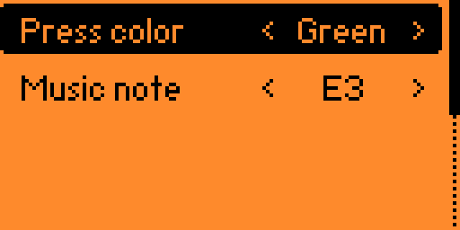
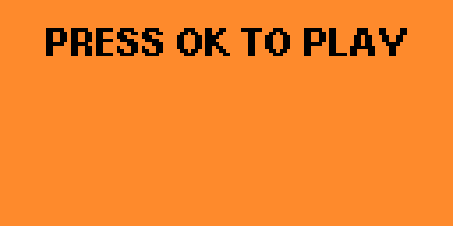
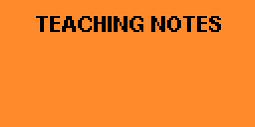
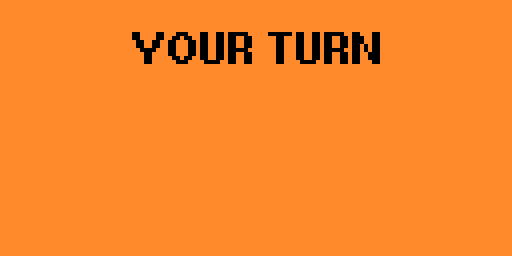
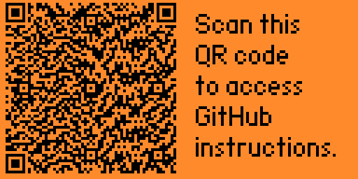

# FlipSimon

## Overview

The FlipSimon application turns your Flipper Zero and FlipBoard into a memory game.  FlipSimon was originally written as a [step-by-step tutorial](../../README.md) to teach C, Flipper Zero Code, and FlipBoard common code - so you can create your own applications.  Based on community feedback, this version of the application was improved to make the application similar to the other released FlipBoard applications.

You can order your FlipBoard from [@MakeItHackin](https://www.youtube.com/makeithackin) using [tindie](https://www.tindie.com/products/32844/) or [Etsy](https://www.etsy.com/listing/1601295558/).  Be sure to also join our [Discord server](https://discord.gg/KTThkQHj5B).

- [Running the app](#running-the-app)
- [Configuration](#configuration)
  - [Action configuration](#action-configuration)
  - [Sub-GHz files](#sub-ghz-files)
  - [Infrared files](#infrared-files)
- [Using the app](#using-the-app)
- [Tutorials](#tutorials)
  - [Video tutorials](#video-tutorials)
- [Updates](#updates)
- [Support](#support)

## Running the app

Make sure your FlipBoard is connected to your Flipper Zero.  On your Flipper Zero, press the `Ok` button.  Scroll down to `Apps` and click the `Ok` button.  Select the `GPIO` folder.  Select the `FlipBoard Simon` application. You should see startup splash screen for a few seconds reminding you to connect the FlipBoard and then the FlipBoard LEDs will do their start-up sequence.

## Configuration

### Action configuration

Go to `Configure application` in the app menu to setup how each action works. You’ll see all of the different buttons listed (for the Simon game, only a single button is used at a time). Press `Ok` to select the Action to configure.

The `Press color` option changes the button color when it’s pressed (or shown).  For the simon game, a less bright version of the press color is used when the button is not pressed.

The `Music note` option changes the sound to play when the button is pressed. You can pick "Off" if you don’t want any sound.

## Using the app

Make sure your FlipBoard is connected to your Flipper Zero. Choose the `Start application` option to launch the app. The game will show `Press OK to play`.  Press the `Ok` button on the Flipper Zero to start the game.

The game will light up a sequence of buttons and play a sound for each color.  Pay attention to the order the buttons are lit up.

After the sequence is shown, the game will show `Your turn`.  You must wait for your turn before pressing any buttons.  You need to press the buttons in the same order they were shown.  If you get the sequence right, the game will show `Teaching Notes` and then show the next sequence.

Keep repeating the sequence until you have completed all of the notes!

## Tutorials

### Video tutorials

 [Flipper Zero - Create your own FlipSimon game!](https://youtu.be/7U9VUhN4e2w)

### Written tutorials
[Step-by-step tutorial](../../README.md) - Create your own Simon game!

## Updates

Version 1.9 - Common code update.
Version 1.8 - Common code update.
Version 1.7 - Common code update.
Version 1.6 - Update default colors/sounds.
Version 1.5 - Spash screen.
Version 1.4 - Improved LED driver.
Version 1.3 - Default colors/sounds
Version 1.2 - Fix crash on exit

## Support

If you have need help, we are here for you.  Also, we would love your feedback on cool ideas for future FlipBoard applications!

Please visit my Flipper Zero Discord server [Flipper Zero Tutorials (Unofficial)](https://discord.gg/KTThkQHj5B) and ask your questions in the `#flipboard` or `#general` channel.
