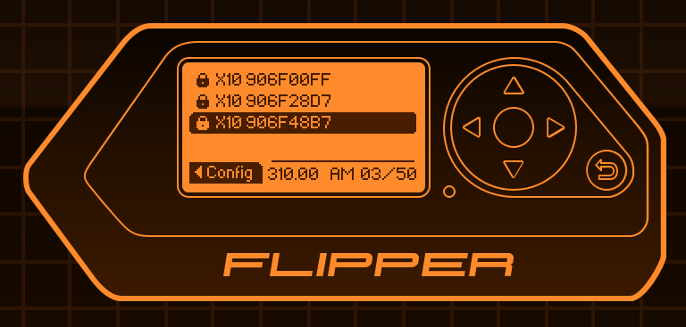

# X10 Decoder
## Introduction
This is a protocol decoder for the Flipper Zero to decode the X10 series of devices when doing a read from the Sub-GHz menu.  




## Validation
NOTE: As an Amazon affiliate I (CodeAllNight) earn from qualifying purchases from the amzn.to links below. 

The code was tested with the "X10 Camera Control System Remote Control Model CR12A" which you can purchase from
https://amzn.to/3issZPs and should also be compatible with signals from https://amzn.to/3QEF7cM 

The receiver I used is no longer for sale, but a similar module can be purchased from https://amzn.to/3CFWy6M 

The House (Channel) is A-P setting.
The Unit (Button) is 1-16 setting (slider switches between 1-8 and 9-16).
The signal is "On" or "Off".  For each channel there is also a "Dim" or "Bright".

The signal is broadcast at 310MHz with a modulation of AM650.


## Installation Directions
This project is intended to be overlayed on top of an existing firmware repo.
- Clone, Build & Deploy an existing flipper zero firmware repo.  See this [tutorial](/firmware/updating/README.md) for updating firmware.
- Add the [x10.c](./x10.c) file to the \lib\subghz\protocols folder
- Add the [x10.h](./x10.h) file to the \lib\subghz\protocols folder
- Update the  \lib\subghz\protocols\protocol_items.h file
  - After all of the other #include statements add the following line:
  ```
  #include "x10.h"
  ```
- Update the  \lib\subghz\protocols\protocol_items.c file
  - After all of the other &subghz_protocol_{name}, entries add the following:
  ```
    &subghz_protocol_x10,
  ```
- NOTE: Your updated files should look similar to the [protocol_items.c](./protocol_items.c) and [protocol_items.h](./protocol_items.h) in this project.
- Build & deploy the firmware.  See this [tutorial](/firmware/updating/README.md) for updating firmware.


## Running the updated firmware
These directions assume you are starting at the flipper desktop.  If not, please press the back button until you are at the desktop.

- Press the OK button on the flipper to pull up the main menu.
- Choose "Sub-GHz" from the menu.
- Choose "Read" from the sub-menu.
- Choose the "Config" option (Click the left arrow)
- Change the frequency to 310.00  (Click the left arrow multiple times)
- Confirm that Hopping is OFF.
- Confirm the Modulation is AM650.
- Press the BACK button.
- The flipper should say "Scanning... and show 310.00 AM 00/50"

Click a button on your X10 remote.

The flipper should show "X10 &lt;some code&gt;"
- Press the OK button on the flipper
It should show the Channel, Button number and the kind of button (ON/OFF/DIM/BRIGHT).