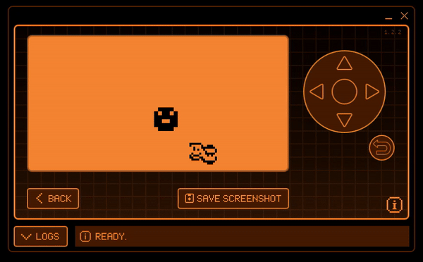

Tama P1 Emulator for Flipper Zero
=======================================

This is a tama P1 Emulator app for Flipper Zero, based on [TamaLIB](https://github.com/jcrona/tamalib/).



How to play
-----------
Create a `tama_p1` folder in your microSD card, and put the ROM as `rom.bin`.
Use a search engine to find the Tamagotchi ROM. There is a file named `tama.b`. 
Rename this to `rom.bin`. 

*Controls in portrait mode are the same as landscape mode, but turned 90 degrees.*
- Left button is A.
- Down or OK is B. 
- Right button is C. 
- Up button takes you to the emulator menu.
- Hold the Back button to save and exit.


Building
--------
Move this folder into flippers `applications_user/TAMA-P1`. 


Launching the app, directly from console to flipper: 
```
./fbt launch_app APPSRC=applications_user/TAMA-P1
```

Run the following to compile icons:
```
scripts/assets.py icons applications_user/TAMA-P1/icons applications_user/TAMA-P1/compiled
```

Note: you may also need to add `-Wno-unused-parameter` to `CCFLAGS` in
`site_cons/cc.scons` to suppress unused parameter errors in TamaLIB.

Debugging
---------
Using the serial script from [FlipperScripts](https://github.com/DroomOne/FlipperScripts/blob/main/serial_logger.py) 
it is easy to add direct logging after running the application: 
```
`python .\serial_logger.py`

`./fbt launch_app APPSRC=applications_user\TAMA-P1;  python .\serial_logger.py`
```
Alternatively, follow the directions here: https://flipper.atmanos.com/docs/debugging/viewing/

Implemented
-----------
- Menu options:
  - Switch between portrait and landscape
  - A+C shortcut (mute/change in-game time)
  - Double / quadruple speed


To-Do
-----
- Fix bugs: 
  - When not on 1x speed, after mashing buttons in quick succession, buttons stop responding for a few seconds. But the rom still runs.
- Stuff to do when bored:
  - optimization and bug fixing (see above)
  - add to this list
  - portrait menu
  - Add "loading bar" when saving
  - "Advanced" settings
  - saving and loading, multiple save states, with the date and time of of each save.
  - Autosave and changing autosave frequency
  - Save settings to /tama_p1/settings.txt


