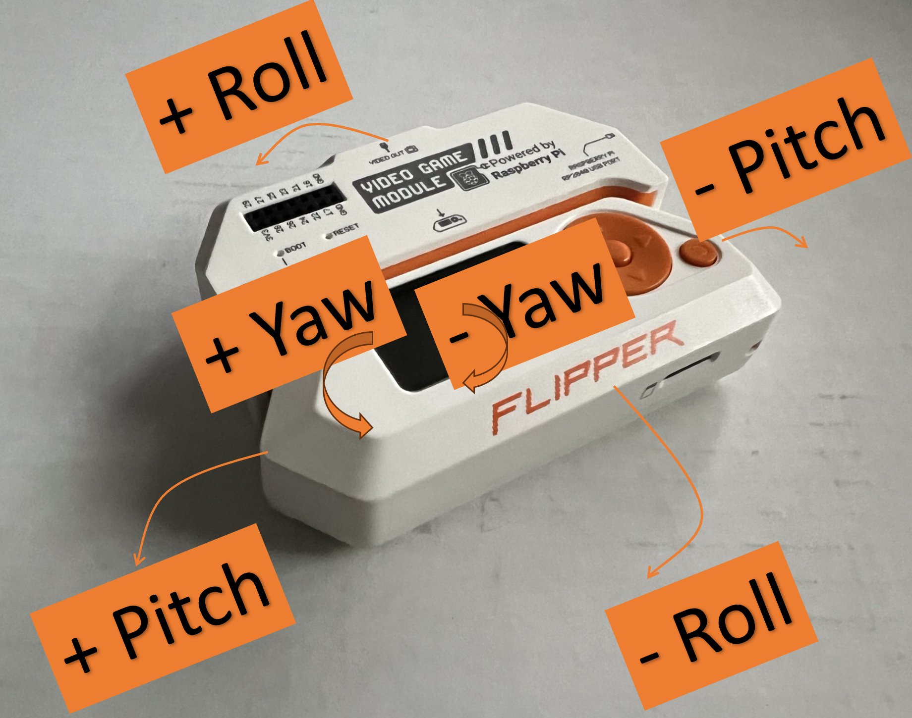

# IMU Controller

## Overview
IMU Controller project is a library that provides a way to interact with the Flipper Zero's IMU sensor in the Video Game Module. IMU stands for an Inertial Measurement Unit, which means we can accurately know the orientation of the device (regardless of where it is within the room).  Pitch and Roll values (the amount of tilt) are used to trigger Up, Down, Left and Right d-pad button presses.  The goal of this library is to enable games to be played using the Video Game Module's IMU sensor, with minimal additional coding required.

## Orientation


The recommended orientation is with the screen facing up & the video game module facing away from you.  To get accurate readings, the device should be held still for a second during initial calibration (typically when the application launches).

### Pitch
Postive pitch is when the device is tilted left.  Negative pitch is when the device is tilted right.  The value is in degrees with the range -90 to 90 (although typically I don't see values larger than 85).  The largest value I've seen is 85, when the IR port is facing the ground.  The smallest value I've seen is -85, when the IR port is facing straight up.  When the pitch angle exceeds the value defined in `.pitch_left` or `.pitch_right` the library will inject a left or right d-pad button press.  When the pitch has moved back by `pitch_hysteresis`, the library will inject a release of the d-pad button.

### Roll
Positive roll is when the device is tilted down.  Negative roll is when the device is tilted to the up.  The value is in degrees with the range -180 to 180.  The smallest value I've seen is -179 and the largest value I've seen is +179, these values are when the screen is facing down.  When the roll angle exceeds the value defined in `.roll_up` or `.roll_down` the library will inject an up or down d-pad button press.  When the roll has moved back by `roll_hysteresis`, the library will inject a release of the d-pad button.

### Yaw
Positive yaw is when the device is rotated counter-clockwise.  Negative yaw is when the device is rotated clockwise.  The value is in degrees with the range -180 to 180.  The smallest value I've seen is -179 and the largest value I've seen is +179, when the device is rotated 180 degrees from the initial orientation when it was calibrated.  Yaw is not used in this library.

## Configuration

The `ImuControllerConfig` structure is used to configure the IMU Controller.  The default configuration is defined in `imu_controller.h` and is called `IMU_CONTROLLER_DEFAULT_CONFIG`.  If your application requires specific configuration, you can create a similar entry in your application and pass it as the second parameter to `imu_controller_alloc`. The default configuration is as follows:

```c
const ImuControllerConfig IMU_CONTROLLER_DEFAULT_CONFIG = {
    .roll_up = 8.0f, // 8 degrees triggers an Up button press
    .roll_down = -8.0f, // -8 degrees triggers a Down button press
    .roll_hysteresis = 3.0f, // 3 degrees of movement is required to release the Up or Down button press
    .pitch_left = 20.0f, // 20 degrees triggers a Left button press
    .pitch_right = -20.0f, // -20 degrees triggers a Right button press
    .pitch_hysteresis = 5.0f, // 5 degrees of movement is required to release the Left or Right button press
    .button_state_long_ms = 300, // 300ms is the time required to trigger a long press event
    .button_state_repeat_ms = 150, // 150ms is the time required to trigger a repeat press event
    .vibro_duration = 25, // 25ms is the duration of the vibration when a button is pressed or released
};
```

## Technical Details


The above image from https://blog.flipper.net/introducing-video-game-module-powered-by-raspberry-pi/ and shows the two ways the Motion-tracking sensor is connected.

The [Video Game Module](https://blog.flipper.net/introducing-video-game-module-powered-by-raspberry-pi/) has a [TDK ICM-42688-P](https://invensense.tdk.com/wp-content/uploads/2020/04/ds-000347_icm-42688-p-datasheet.pdf), which is a 6-axis MEMS motion-tracking sensor (IMU) the combines a 3-axis gyroscope and a 3-axis accelerometer.  The IMU sensor uses the SPI protocol (pins 2-6 on the Flipper Zero) to communicate directly to the Flipper Zero.

The [Video Game Engine](https://github.com/flipperdevices/flipperzero-game-engine) provides a [imu.h](https://github.com/flipperdevices/flipperzero-game-engine/blob/dev/sensors/imu.h) file, giving us access to the last known pitch, roll and yaw values.  The data provided has increased accuracy since the code uses a Madgwick AHRS algorithm.  See [Madgwick's paper](https://github.com/xioTechnologies/Fusion?tab=readme-ov-file#ahrs-algorithm) for more information.

When you call `imu_controller_alloc`, it invokes `imu_alloc()` causing intial calibration data to be is calculated.  For best results, it is recommended that the device **does not move** during calibration and that the orientation is similar to the orientation it will be used in.  If needed, your application can invoke `imu_controller_recalibrate` to recalibrate the IMU sensor.


## Adding the Library to your Project

### Step 1: Add the Flipper Zero Game Engine Library as a Submodule

In the root of your project, where your `application.fam` file is located, you can add the Flipper Zero Game Engine as a submodule.  To add the library to your project, use the following command:
```cmd
git submodule add https://github.com/flipperdevices/flipperzero-game-engine.git engine
```

### Step 2: Copy the imu_controller.h and imu_controller.c files to your project

Copy the `imu_controller.h` and `imu_controller.c` files from this repository to your project.  It is assumed these files are in the same directory as where you ran the git submodule command.

### Step 3: Update your main program to include the IMU Controller

At the top of your main program, include the `imu_controller.h` file, typically after the other includes.  For example:
```c
#include "imu_controller.h"
```

### Step 4: Create a queue method to inject Input Events

Typically your application will have a message queue to handle input events.  You can find `furi_message_queue_put` commands and see what kind of event your application expects.  There are two common patterns... either using an `InputEvent` or a custom named event (like `PluginEvent`, `SnakeEvent`, etc.)

```c
static void doom_imu_queue(FuriMessageQueue* event_queue, InputType type, InputKey key) {
    InputEvent input_event = {.type = type, .key = key};
    PluginEvent event = {.type = EventTypeKey, .input = input_event};
    furi_message_queue_put(event_queue, &event, 0);
}
```

or

```c
static void game_imu_queue(FuriMessageQueue* event_queue, InputType type, InputKey key) {
    InputEvent input_event = {.type = type, .key = key};
    furi_message_queue_put(event_queue, &input_event, 0);
}
```

### Step 5: Create and Start the IMU Controller

In your main application entry point, create and start the IMU Controller.  For example:

```c
    ImuController* imu_controller =
        imu_controller_alloc(event_queue, &IMU_CONTROLLER_DEFAULT_CONFIG, doom_imu_queue);
    imu_controller_start(imu_controller);
```

### Step 6: Free the IMU Controller

In your main application entry point, free the controller when the application is done.  For example:

```c
    imu_controller_free(imu_controller);
```

## Support

The best way to get support is to join the Flipper Zero Tutorials (Unofficial) Discord community. Here is a [Discord invite](https://discord.com/invite/NsjCvqwPAd) to join my `Flipper Zero Tutorials (Unofficial)` community.

If you want to support my work, you can donate via [https://ko-fi.com/codeallnight](https://ko-fi.com/codeallnight) or you can [buy a FlipBoard](https://www.tindie.com/products/makeithackin/flipboard-macropad-keyboard-for-flipper-zero/) from HackItHackin with software & tutorials from me (@CodeAllNight).