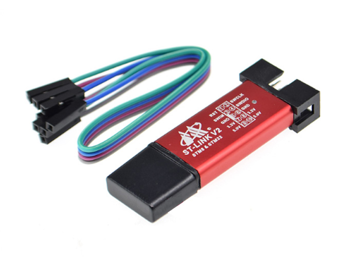

# Install st-flash

### macOS

`brew install stlink`

# Update ST-Link firmware 

Some Chinese ST-Link clones won't work with latest `stlink` utils. Upgrade firmware to fix this

1. Connect St-Link adapter to Windows PC and install driver [ST-Link_Windows_driver.zip](https://github.com/Flipper-Zero/flipperzero-firmware-community/raw/master/wiki_static/tools/en.stsw-link009.zip)
2. Run [Firmware upgrade util](https://github.com/Flipper-Zero/flipperzero-firmware-community/raw/master/wiki_static/tools/en.stsw-link007_V2-37-26.zip)

